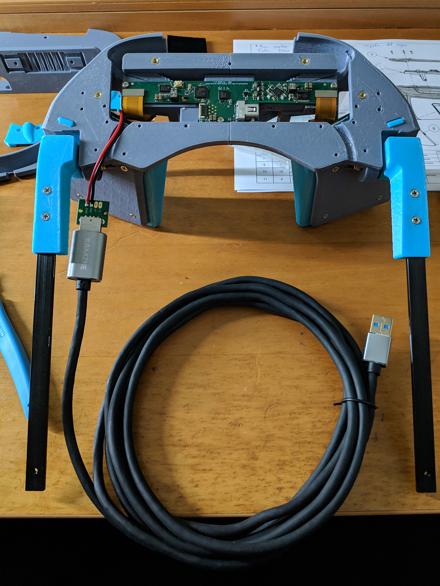

***

Once we have the optics, electronics, mechanical parts, and all the 3D-printed parts, we are ready to start building the headset.
To do so, we will follow the [Assembly drawing from the NortStar repo](https://github.com/leapmotion/ProjectNorthStar/blob/master/Mechanical/Assm%20Drawing%20North%20Star%20Release%203.pdf).

***

# 230-000 and 240-000 - Left and Right Brake

If we take a look at the first page with instructions starting from the end of the document, we will find the 230-000 instructions.

These parts were updated not long ago, so if you have downloaded them recently, you should be missing the two cable-guides on the top of the picture above and have a reinforced version of 230-001/240-001.

When assembling this parts, take into account that even if the assembly drawing doesn't show it, you have to put the welding headgear between the hinge parts.

To put the spring in place, you will have to turn it 180 degrees loading it, this can be easily done putting the spring in place in both parts and turning around one of them. 

***

# 210-000 - Padded Forehead

First, we need to bend the forehead headgear span, to do this, it's recommended to turn the heated bed of your 3D printer to 70 °C, which is enough to shape the part, if you don't have access to a heated bed, don't worry, other options are:

+ Using a Heat Gun.
+ Using hot water.
+ Anything that gets the piece to ~70 °C.

You can now shape the piece with a mannequin head or your own head if you cover your skin to avoid first degree burns (not really, just be careful). [Demo video by Florian Maurer.](https://www.youtube.com/watch?v=FLRj4_IuamE)

Once we have the piece bent, it's time to wrap up the foam, to do so, I did this, **I'm not 100% sure this is the best/correct way to do it**, but it worked out fine for me. Take into account that the felt-like side is the smoothest one and should be the one in contact with your forehead.

Now, let's put the hinges in place, again, remember to put pieces 230-000 and 240-000 between the two pieces of each hinge. I found it easier to lock in place the hinge base (shown in the picture below) and screw the cap on top.

***

# 200-000 - Headgear

You should have now the headgear assembled, just like the pictures below, with **two differences**, the **reinforced parts** and the **absence of the cable guides**.

***

# 131-000 Simplified Electronics Bay

You can either do 131-000 or 121-000, both assemblies are similar, I chose the simplified one.

First, join 131-001 and 131-002, as easy as pie.

Then, grab a soldering iron to insert the heat inserts as shown.

It should end up like this.

Finally, attach the driver board and go to the next step!

***

# 120-000 - Halo Electronics Module

This build is the 3.1 version, so we don't need this part.

***

# 113-000 114-000 - Rot. Slide Mount

**Spoiler: You will probably want to dissasemble the left one (113-000) in a few steps, so don't waste time screwing now.**

You will need to take out the endcaps later to assemble everything together, so don't worry about them now.

Again, this pieces have been updated, the endcap (now 110-006) looks like this:

And pieces 113-001 and 114-001 are now divided in 113-001, 113-002, 114-001 and 114-002.

***

# 111-000 112-000 - Displays

You can choose between 25cm and 75cm of focal distance, simply put, the difference between them is the distance at which the objects will appear to be. If you don't know which one to use, (as a personal recommendation), build the 25cm one, as far as I know, it is the most used one.

First, using the soldering iron like before, let's do the heated inserts, four in each tray.

The following part is probably (at least for me) the most difficult one, you have to peel the ribbon cable from the back of the displays **very carefully**. Some people have preheated a little bit the ribbon so it comes off easier, I did mine without applying heat, **very carefully**, like taking a sticker off, slowly. I helped myself with a phone-screen removing tool - guitar pick - plastic thing. Something like this that turned out very helpful:

One last time, be very careful doing this, it's totally doable at the first attempt, but the last thing you want is to tear the ribbon off.

Once the ribbons are ready, they should look like this:

Now, remember to remove the supports from the screen trays and then slide both screen inside.

***

# 130-000 - Simplified Optics Module

Explanation time! There are more pieces than necessary in the picture above, 120-002 (Halo lid) works if you just want 3 dof in your headset, however, there is a modular lid that can be assembled from pieces 130-003, 130-004, 130-005 and 130-006. I **strongly** recommend to use the modular lid instead of the Halo one, even if you don't plan to incorporate 6 dof. 

If you want to go 6 dof, the modular lid will allow you to use the MultiMount or the Vive Tracker pieces. 

+ The MultiMount is a piece that (as far as I know) Noazark uploaded to the [NorthStar discord server](https://discordapp.com/invite/ATPm9Fy) that allows you to add an Intel T265 or a Occipital Structure Core sensor to the headset. The .stl file is pinned in the channel #build-tweaking of the server.
+ If you want to use a Vive Tracker, you can find the piece in the [North Star mechanical folder in the repo](https://github.com/leapmotion/ProjectNorthStar/tree/master/Mechanical/).

Let's continue with the build now, if you have decided to go with the modular lid (wise decision), you will have to do four heated inserts in the Simplified Optics Main Body.

Next, let's attach parts 113-000 and 114-000 (Rot. Slide Mounts) to the main body.

Then, screw the Simplifies Electronics Bay to the main body. After that, you have to connect the power cables of the driver, make sure to connect the red wire to the pin that has a positive sign above. It should look like this:

Now it's time to place the screen ribbons, you want to avoid as much as possible creasing the ribbons, I set mine this way, **it may not be the perfect way to do it**, but I am happy with the result. You can use a little bit of double sided tape to keep the cables away from the screens.

If you plug the USB extension cord now, you should have something pretty much like this:

So... Do you remember a few lines ago when I said that you would probably want to disassemble the left Rot. Slide Mount? Here it comes.

Again, in the [NorthStar discord server](https://discordapp.com/invite/ATPm9Fy), Noazark posted a very cool USB housing to keep the power adapter and the extension cord together. You can find two files called USBHousing2T.stl and USBHousing2B.stl pinned in the #3d-printing channel.

We can now screw it on top of the Left Slide Mount:

Let's continue with the mini DisplayPort cable, once this is connected, you can screw pieces 130-005 and 130-006 in place (from the modular lid).

You can get the LeapMotion and the 6 dof solution cables under these pieces too, I decided not to do so as I want the sensors to be interchangeable.

Then, screw 130-004 in place (or the MultiMount/Vive Tracker piece if that is what you decide to go with), and then put 130-003 on top to finish the modular lid assembly.

We will finish this part by placing the reflectors, if they don't go in easily, sand the 3d printed part a bit, don't force the reflectors.

***

# 110-000 - Hinged Optics Bracket

This is part of the 3.0 version, so I won't be covering this.

***

# 100-000 - Optics

The only thing we have left is to place the Facial Interface (115-002 in the .stl folder), it's recommended to wrap it in foam/fabric for extra comfort.

I used the foam piece left from the [Smart prototyping](https://www.smart-prototyping.com/AR-VR-MR-XR) kit by cutting it to size and using a stripe of double sided tape.

Screw it in place and you are ready to go.

***

# 000-000 North Star Release 3.1

Last but not least, we have to join the Optics and the Headgear Assemblies, once you do this, screw the endcaps.

## Congratulations, you should have a functional NorthStar headset!

***

Thanks to everyone in the Discord server for the help, specially [Noazark](https://twitter.com/noazark) and [Bryan](https://twitter.com/BryanChrisBrown) (go follow them if you are not doing it already) for everything they do for the NorthStar community. Also LeapMotion (Now Ultraleap) for releasing the NorthStar project to the world.

***

Related links
+ [Headset assembly video by supertask_jp @ Twitter](https://youtu.be/J-OowCNcR8A)
+ [Discord server](https://discordapp.com/invite/ATPm9Fy)
+ [Github repo (Mechanical)](https://github.com/leapmotion/ProjectNorthStar/tree/master/Mechanical/) 
+ [Smart prototyping](https://www.smart-prototyping.com/AR-VR-MR-XR)

***
