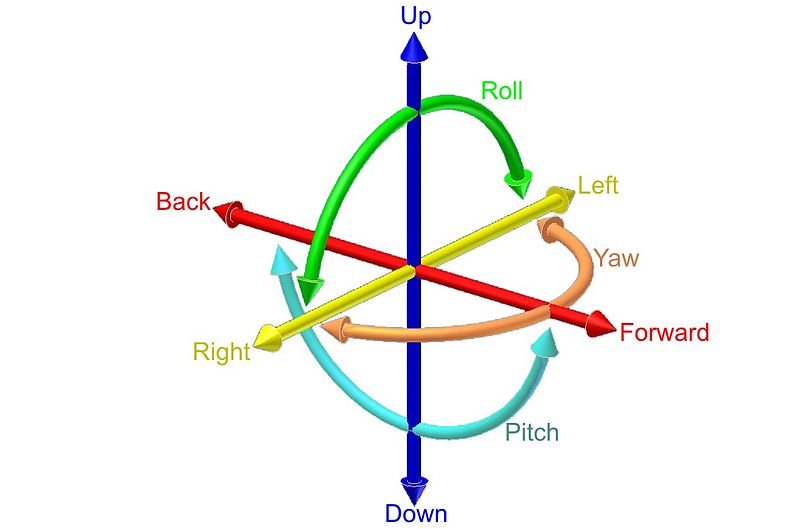
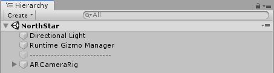
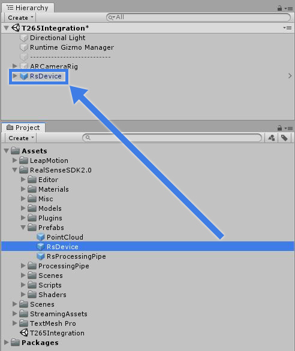
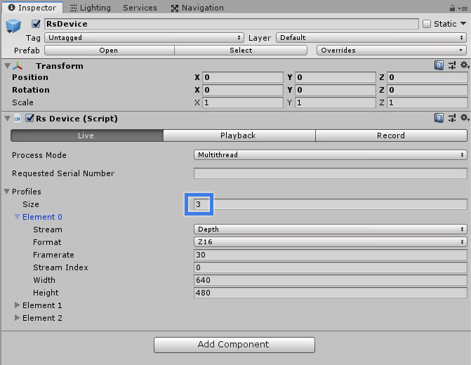
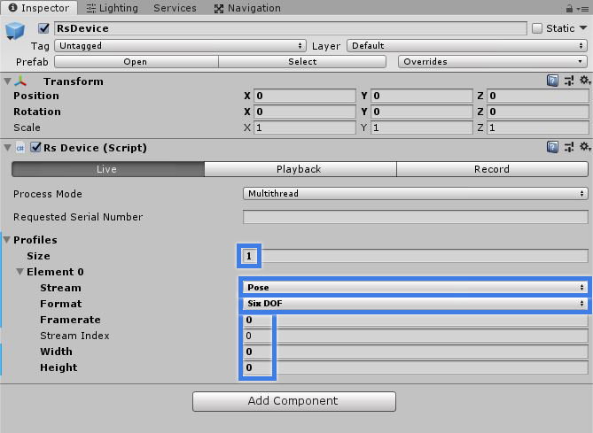
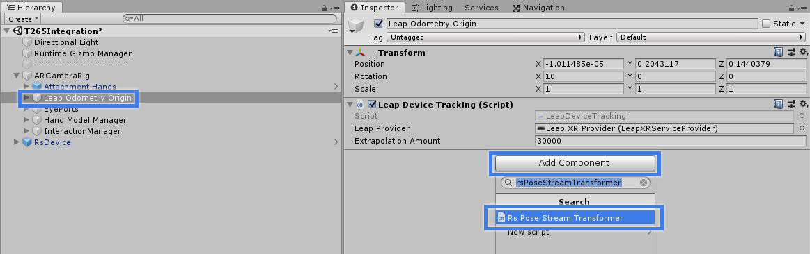
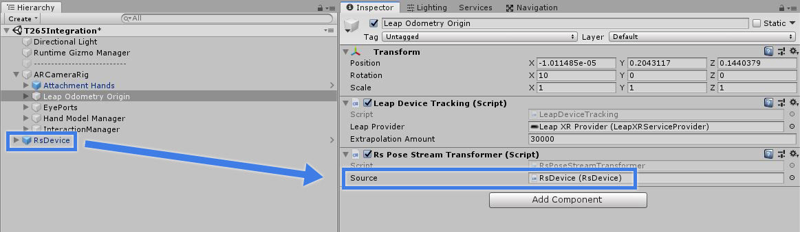

***

If you just want to read how to do the unity integration, jump to [Unity Integration](#UnityIntegration)

***

# Terms

* Pose: Combination of a position and an orientation.
* Depth: Estimation of the distance between the user and the environment (Points).
* Inside-out tracking: Spatial tracking method based on the cameras/sensors being on the tracked device.

***

# Spatial Tracking

If you haven't done any modifications to your NorthStar headset, you have a 0 degrees of freedom (dof) device, this means it won't take into account any movement you do, everything is "fixed" to the world coordinate system, even your headset. If you place a cube in front of you and turn your head in any of the three axis (pitch, roll, yaw), the cube will follow your movements. Same thing happens if you move along any of the three axis (forward-back, up-down, left-right).

We can upgrade our headset to have 6 dof, if we do this, our headset will move relative to the world coordinate system, allowing us to move around everything situated in both the real and virtual world (We can now fix objects in real-world positions and they will stay there!).

***

# Solutions 

There are a few options to track the headset in space, some of them (the most used ones) are:

|&nbsp;&nbsp;**Devices**&nbsp;&nbsp;&nbsp;|&nbsp;&nbsp;&nbsp;**Pose**&nbsp;&nbsp;&nbsp;|&nbsp;&nbsp;**Inside-out tracking**&nbsp;&nbsp;|&nbsp;&nbsp;**Depth**&nbsp;&nbsp;|
|--------------------------------|:-------------:|:------:|:------:|
| Intel Realsense T265           |      Yes      |   Yes  |   No*  |
| Occipital Structure Core       |      Yes      |   Yes  |   Yes  |
| Vive tracker                   |      Yes      |  No**  |   No   |

*While not oficially supported, the [Intel page](https://www.intelrealsense.com/tracking-camera-t265/) states that it is possible to compute a suboptimal dense depth. This is left as an exercise for the reader.

**To use a Vive tracker, you must have a Lighthouse system.

I decided to use an Intel Realsense T265 device, mainly because of it's price and my needs, so that is what we will be integrating in Unity next.

***

# Unity Integration

The first thing you want to do is go to the [Intel Realsense Unity Wrapper github page](https://github.com/IntelRealSense/librealsense/tree/master/wrappers/unity) and then download the [realsense.unitypackage](https://github.com/IntelRealSense/librealsense/releases/download/v2.20.0/realsense.unitypackage).

Once you have downloaded it, drag and drop it into your [NorthStar Unity project](https://github.com/leapmotion/ProjectNorthStar/tree/master/Software).

Your hierarchy should look like this:

Navigate through your project folders **Assets -> RealSenseSDK2.0 -> Prefabs** and drag and drop the **RsDevice** prefab in your hierarchy.

Once you have the RsDevice gameobject in your hierarchy, click it and look at the inspector, it should have three profiles by default:

Change it to one, then, set the **Stream** variable to **Pose**,the **Format** to **Six DOF** and **Framerate**,**Stream Index**,**Width** and **Height** to zero.

Now, navigate to **ARCameraRig -> Leap Odometry Origin** in your hierarchy, click **Add Component** and look for **Rs Pose Stream Transformer**

Drag and drop your **RsDevice** in the **Source** variable of the **Rs Pose Stream Transformer** you just added. 

Now you can add a cube to your scene, scale it down a bit, place it in front of the headset and hit play, and you should be able to move around the cube!

***

Related links
+ [Intel Realsense](https://www.intelrealsense.com/)
+ [Occipital Structure Core](https://structure.io/structure-core)
+ [Vive trackers](https://www.vive.com/us/vive-tracker/)
+ [Github repo (Software)](https://github.com/leapmotion/ProjectNorthStar/tree/master/Software) 
+ [Discord server](https://discordapp.com/invite/ATPm9Fy)

***
