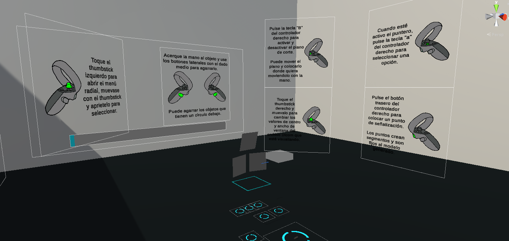

***

This post will cover some of the features of a Virtal Reality DICOM file viewer implemented in Unity3D. It uses VRTK4 as a base for the VR part and EvilDICOM to manage the DICOM part of things.

<iframe src='https://gfycat.com/ifr/FirsthandEvergreenHarpyeagle' frameborder='0' scrolling='no' width='100%' height='100%' style='position:absolute;top:0;left:0;' allowfullscreen></iframe>

***

# What is DICOM?

DICOM (Digital Imaging and Communication On Medicine) is the standard for the communication and management of medical imaging information and related data. This means that DICOM files store much more than pixel data, they store patient info, clinical trial info, etc. This post will focus on the file type, more precisly, on Computed Tomography scans and Magnetic Resonance imaging, but keep in mind that DICOM is a much bigger standard that covers a lot of things like storage or network protocols.

***

# Why DICOM?

It would be possible to try to reconstruct a 3D visualization of the scan from, let's say, a bunch of PNG images that represent each of the slices taken during the procedure. This would result in a poor visualization, since we wouldn't have key information such as the space between each slice. DICOM files keep all the information we need bonded together.

Furthermore, DICOM is used in *almost* every hospital on earth and every system that interacts with medical imaging information of any kind works with it.

Developing a medical application that complies with DICOM ensures interoperability with different systems from different manufacturers.

***

# Features

***

* **Volumetric rendering**: A volumetric rendering shader based on raymarching has been developed in HLSL to reconstruct a 3D representation of the image data stored in the DICOM file.

***

* **Manipulation of the 3D reconstructed scan**: The generated model can be moved, this includes, translation, rotation and scaling.

***

* **Asynchronous generation**: The load/generation of the 3D model is performed asyncronously, allowing the computer to process big files while keeping the virtual reality experience frame-drop free to ensure comfort.

***

* **Clipping plane**: The clipping plane allows the user to "cut" through the model, visualizing the interiors of the reconstructed scan.

<iframe src='https://gfycat.com/ifr/UnlawfulCrazyGourami' frameborder='0' scrolling='no' width='100%' height='100%' style='position:absolute;top:0;left:0;' allowfullscreen></iframe>

***

* **Projection pointer**: A pointer allows the user to localize a point. Three grabbable screens show the projection said point indicates in the three body planes, (Sagittal, Coronal and Transverse).

<iframe src='https://gfycat.com/ifr/SlimyBlandCowbird' frameborder='0' scrolling='no' width='100%' height='100%' style='position:absolute;top:0;left:0;' allowfullscreen></iframe>

***

* **Window adjustment**: DICOM supports different "window" center and widths, this means that there are some parameters that can be tweaked during rendering to show different tissues (bones, fat, muscles... even fabric!).

<iframe src='https://gfycat.com/ifr/WarlikeHarmlessBorzoi' frameborder='0' scrolling='no' width='100%' height='100%' style='position:absolute;top:0;left:0;' allowfullscreen></iframe>

***

* **File explorer**: An in-application file explorer allows the user to navigate through folders and disks to choose what file to load without interrupting the virtual workflow.

***

* **Help panels**: Graphic information is displayed to indicate each button effect.

***

* **Performance and specifications**: Fluent load and movement with no frame drops on a consumer laptop (i7-7700 - gtx1060 6gb - 8gb RAM).

***

All the project has been documented using XML documentation in C# and Doxygen has been used to generate a static web page of said documentation.

***

Related links
+ [DICOM standard](https://www.dicomstandard.org/)
+ [VRTK4](https://github.com/ExtendRealityLtd/VRTK)
+ [Evil-DICOM](https://github.com/rexcardan/Evil-DICOM)

***
