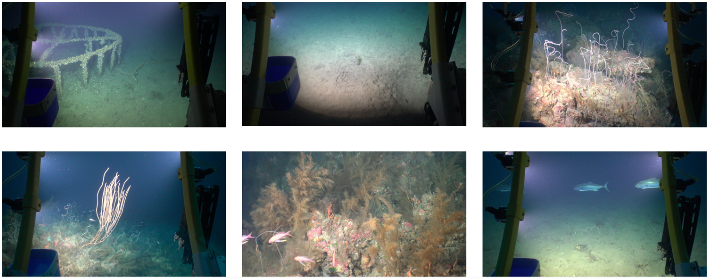
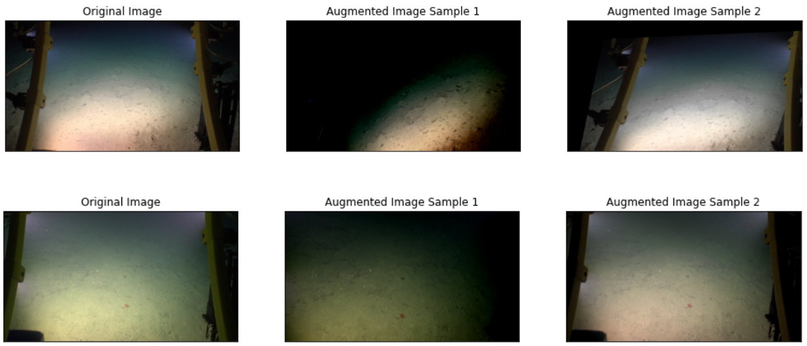
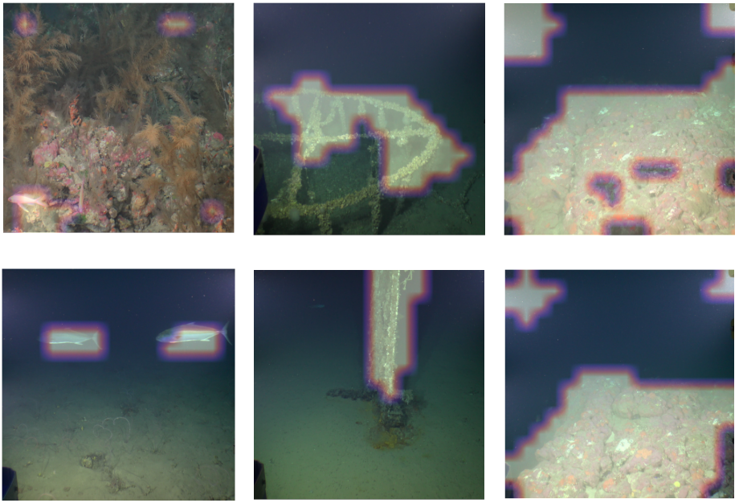

***

A few weeks ago (September 2021) I participated in the SPEGC Datathon. This post covers my team's solution, which was chosen as the winning approach and therefore got us the first prize!

The team was randomly formed so we didn't know each other before the competition, final team members were: [Adrián Pascual Bernal](https://www.linkedin.com/in/adri%C3%A1n-pascual-bernal-536a12176/), [David Lacalle Castillo](https://www.linkedin.com/in/david-lacalle-castillo-5b6280173/), Cesar Muñoz Araya and me, [Guillermo Sánchez Brizuela](https://www.linkedin.com/in/guillermo-sanchez-brizuela/). Our tech stack was primarily composed of Tensorflow/Keras, Pytorch/FastAI, Albumentations, Jupyter Notebooks and Anaconda. Code is available here: [https://github.com/guillesanbri/spegc-datathon](https://github.com/guillesanbri/spegc-datathon)

***

# The Datathon

This Datathon was organized by the [SPEGC (Sociedad de Promoción Económica de Gran Canaria - Gran Canaria's Economic Promotion Society)](https://www.spegc.org/). Participation was open to the whole world but due to the linguistic scope of the competition, participants were mainly from Spain and Latin American countries. The format of the competition was a data science oriented Hackaton, this is, a set of problems were given along a dataset, and every team had to develop and submit a solution in two and a half days.

***

# The dataset

As previously mentioned, at the start of the competition, all teams gained access to a curated dataset of images. The dataset was provided by [PLOCAN (Plataforma Oceánica de Canarias - The Oceanic Platform of the Canary Islands)](https://www.plocan.eu/) and contained around 5.3k underwater images of size 3840 x 2160 pixels (w x h), taken by underwater ROVs (Remotely Operated Vehicles). These images were divided in two subsets, one part (~2.8k images) was tagged based on the type of submarine floor, and the other one (~2.5k images) was tagged based on the presence of a series of elements. Both datasets are closely related to the main challenges, explained below. Some samples of these images are shown in Figure 1.

<figure align="center">
  
  <figcaption>Figure 1: Random samples from the dataset. Source: PLOCAN.</figcaption>
</figure>

***

# Challenges

The competition posed two main challenges and a set of "minor" challenges.

### Main challenge #1

Using the first subset of the dataset, a classification model had to be trained to classify the floor in a given image. The floor type options were sandy, muddy, muddy-sand and reef. Reef was quite different from the other three, while these others main difference was the granularity of the particles of the floor.

### Main challenge #2

Now using the second part of the dataset, a second classification task was proposed: Classifying images based on the presence of different elements. Annotated classes were ripples, fauna, algae, waste and rocks. It is important to note that this was a **classification** task and the dataset was annotated only with the name of the main present element. **No location annotations** were provided to train an object detection model. 

### Secondary challenges

1. Solving both problems at the same time: This is, making a classifier capable of classifying both the floor type and the element presence.

2. Detecting the elements in the image: As no location tags were given, predicting the position of the detected element in the image was a challenging task.

3. Making the model robust to resolution changes: All the given images were the same size, but videos with different resolution and compressions are also recorded by PLOCAN and the model would ideally be resilient to input size changes.

4. Finding subcategories of the proposed element's classes: For example, detect different types of trash using unsupervised learning.

5. Making the model resistant to the absence of the ROV structure: In a great percentage of the images, the metallic structure of the ROV appears in the sides of the photo. The idea behind this task is to make the model able to perform equally well if no structure is present.

6. Making the model robust to different optical conditions: Underwater lighting can vary a lot due to the cloudiness of the water and external light sources. Furthermore, the ROV camera orientation can change, altering the perspective of the photos.

Apart from this, results reproducibility and model inference scripts were positively valued.

***

# Core ideas

There were a few ideas that we all agreed with. Due to the reduced time frame we had, transfer learning and fine tuning models were a must, as there was no time to train and test randomly initialized architectures. Additionally, the dataset was limited and the secondary challenges were demanding, so data augmentation was something everybody considered necessary as well. We needed a way to compare results between architectures and approaches, so we divided the datasets in train/validation splits (80/20). We made this split stratified to ensure no class was underrepresented. Once the dataset was splitted, the validation subset was used to evaluate the model using weighted accuracy as the metric.

***

# Data augmentation

Although secondary challenges were not a priority, we considered them since the beginning of the competition. One outcome of this consideration was the inclusion of a quite aggressive data augmentation process during training, randomly parametrized on each epoch. We used data augmentation to deal with the lack of very different scenarios and to avoid overfitting. Guided by a subset of the secondary challenges, augmentations used were:

- Blur (Secondary challenge #6)

- Brightness and contrast (Secondary challenge #6)

- JPG compression (Secondary challenge #3)

- Saturation (Secondary challenge #6)

- Affine transformations: Translation, Rotation, Mirroring, Scale (Secondary challenge #3 and #6)

- Projective transformations (Secondary challenge #6)

These augmentations were implemented using [Albumentations](https://albumentations.ai/docs/). Some sample results are shown in Figure 2.

<figure align="center">
  
  <figcaption>Figure 2: Random augmentations applied to images of the dataset. No crop has been performed on these images.</figcaption>
</figure>

***

# Preprocessing

Another one of the secondary challenges (#5) was dealing with the metallic structure of the ROV. To solve this, we integrated two layers immediately after the Input layer of the tested architectures: a central crop of 2/3 of the image, and a resizing operation of this crop to 512x512. These two operations helped with multiple issues:

- No metallic structure makes it to the actual network, so no overfitting to the structure.

- The input image size is now trivial, as the crop is relative to the original size and the cropped region of interest is scaled to a fixed size of 512x512. Thanks to this, although all images were the same size, we could leave the input shape unspecified in the network. Moreover, making the input size trivial helps significantly with the secondary challenge #3.

- As the cropping operation reduces the size of the image, less information is lost when scaling down, due to the to-be-scaled image being smaller.

We also tried out different underwater image enhancement techniques [[arXiv](https://arxiv.org/abs/1907.03246), [GitHub](https://github.com/wangyanckxx/Single-Underwater-Image-Enhancement-and-Color-Restoration)], but desisted after finding the results practically unnoticeable. 

***

# First challenge

As mentioned before, due to the limited number of images and the temporal constraints, using transfer learning was the best option. The first day we tried multiple architectures, including ResNet34, ResNet50, ResNet152, a Darknet backbone, Xception, and even a Vision Transformer (ViT). We removed the classification head of these networks and added a Global Average Pooling layer and a fully connected layer of 4 neurons. During model fitting, we also specified class weights to balance the effect of each class in the loss function based on the distribution of tags. This way, if a class number of images was 10% the number of images of another class, each example of the first class had a 10x impact on the update of the gradients.

To train the models, we freezed all the weights (pretrained on Imagenet) except the output layer and fitted until validation loss stopped decreasing (Early Stopping). Then, we unfreezed the whole model and fine tuned the weights with a smaller learning rate. The optimizer used in both phases was Adam.

After comparing the validation results of the different architectures, we choose a ResNet152v2 model with the specified augmentations and the mentioned central crop. This solution got a weighted accuracy of 0.961 in the validation set.

After choosing the model and the hyperparameters, we trained the model again using the entire dataset of floor images to ensure that the model had been trained on as much data as possible before sending it to the organization evaluation.

***

# Second challenge

Due to the time limitations of the competition, once we had the model and preprocessing for the first challenge working we decided to avoid looking for new architectures and reused all the code for training and inference we had for the floor type classification. The only change we made was in the output layer of the network to change the four output neurons to five (as the second challenge had five classes). After changing this last layer, we proceeded to repeat the process of doing transfer learning with the ResNet152v2 trained on Imagenet and fine tuning the whole network. This time, we got a weighted accuracy of 0.963 in the validation split of the elements dataset.

One thing that went over our heads during the competition was using the model trained with the first dataset as the base for transfer learning in this task. It would had been a good experiment to try.

The final model was then trained on the entire elements dataset (train + val) in a similar fashion to the previous model.

***

# Object detection

One of the secondary challenges (#2) was to detect the elements of the second challenge, which came without any localization labeling. This is called Weakly Supervised Object Detection in the academic literature, however, none of the team members knew anything about this field and there were little to no time to learn about it.

Despite all the available research in this area, due the lack of time to search and use a good suited method we ended up improvising our own solution in a creative way. We used a visual explainability [[arXiv](https://arxiv.org/abs/2004.14545)] method called Grad-CAM [[arXiv](https://arxiv.org/abs/1610.02391)] to perform element localization. Grad-CAM uses the gradient of the output of a deep convolutional neural network to generate an (output) influence heatmap of a feature map in the last convolutional layer. This way, we extract a coarse segmentation thresholding the heatmap generated for the predicted class (ie. If the networks predicts fauna, we looked for the activations that lead to classifying the image as fauna).

We trained a ResNet34 classifier with the same augmentation and preprocessing and applied Grad-CAM directly in it to perform element detection. Once we had the heatmap of the last convolutional layer influence over the output, we scaled said map and generated a binary mask by thresholding the heatmap. Different results of this method are shown below in Figure 3.

<figure align="center">
  
  <figcaption>Figure 3: Grad-CAM coarse segmentation results in the validation set. From left to right, columns label is Fauna, Waste and Rocks.</figcaption>
</figure>

Although further work is required as there are some false positives, results are promising and demonstrate the ability of the method to detect both predominant elements (rocks, waste, big fish) and smaller elements (fish in the lower left corner of the upper left image).

***

# Not implemented approaches

We also had a few ideas that couldn't be executed:
- We would have liked to explore some unsupervised clustering of the images based on their similarity to group pseudo-consecutive frames (the images from the dataset were sampled from videos, so there were some similar images). Once grouped, the train and validation splits could have been done taking into account videos to get a more precise validation metric. 

- Another approach we didn't get to try was passing the elements images through the floor detector to annotate them. Once annotated, we planned to build a bicephalous model that could predict both the type of floor and the elements in the image. We ended up rejecting this idea due to the lack of actual tags, and therefore, the inability to check the real performance of the model in a trustworthy way. 

- This lack of annotations also penalized another approach (this one we got it working) where we built a multi label classification model to detect more than one label per element image (eg. some images had both algae and fauna), but again, we couldn't measure the real performance of this model and discarded it before dedicating any more time.

***

# Conclusion

I think I speak on behalf of everyone if I say that we have hit it off with the team and enjoyed the competition a lot. I have also learned quite a few things along the datathon thanks to both my teammates and the needs of working at such a fast-paced environment. Last but not least, thanks to everyone in the organization team for making this experience possible. That's all!

***

Related links
+ [Datathon event page](https://www.spegc.org/formacion-y-eventos/datathon/)
+ [Results announcement](https://www.spegc.org/2021/09/23/el-cabildo-de-gran-canaria-valora-los-resultados-del-primer-datathon-de-datos-turisticos/) 

***