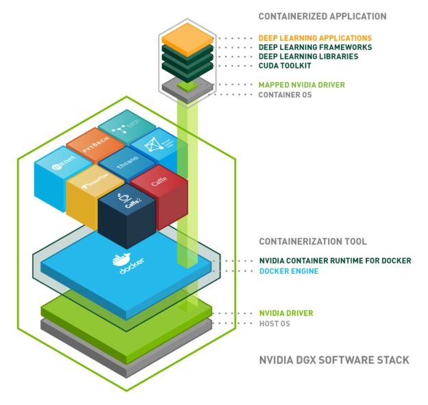
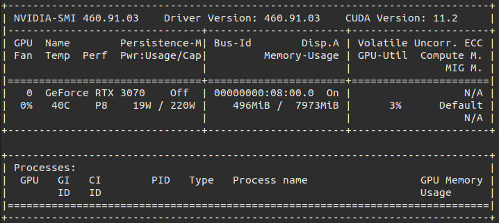

***

Long time no see! What a year huh? After quite a while without posting here I am trying to return to writing, so let's go!

In this post I will be going over the steps that I have followed to set up the software stack of my actual deep learning rig, which is a desktop computer running **Ubuntu 20.04 LTS**. More specifically, the Docker plus CUDA runtime setup to manage deep learning libraries versioning, as installing different CUDA/cuDNN versions can get messy really fast.

***

# Disclaimers

1. **This post assumes that you already have official NVIDIA drivers correctly installed in your computer. Keep them up to date afterwards!**

2. I am by no means an expert in Docker so always check and know what you are doing in your computer when changing privileges and installing stuff, specially if you plan to set up a development server open to the internet.

***

# So, what's the problem?

If you have a computer with a GPU and tried to install tensorflow or pytorch to get advantage of the parallel computing power of your pc, you have already run into CUDA and cuDNN. The first is a parallel computing platform developed by NVIDIA for their GPUs that makes possible for programmers to develop and execute general purpose code in their GPUs. The second one, cuDNN, is a library of GPU-accelerated primitives for building neural networks. If you work with libraries like tensorflow or pytorch, you won't need to deal with them directly, but they must be correctly installed in your system if you want to GPU-accelerate those training steps.

CUDA is great and it accelerates the training and inference of neural networks by orders of magnitude, however, its versions, specially when mixed with GPU model constraints and DL library requisites, can cause a lot of confusion.

This confusion can be worked through looking at the [pytorch installation shortcuts](https://pytorch.org/get-started/locally/) or the [tensorflow GPU version table](https://www.tensorflow.org/install/source#gpu). However, if you have successfully installed one version of, let's say, tensorflow, but the model from a repo you have just downloaded requires another version, CUDA versioning can get problematic fast.

***

# Why Docker?

There are alternatives that you probably already know, virtual environments such as Anaconda [deal with CUDA](https://docs.anaconda.com/anaconda/user-guide/tasks/gpu-packages/) versions while installing DL libraries. However, I, personally, have encountered problems with the configurations and installation of correct versions more than once. I like Anaconda a lot and use it daily for simpler environments, but I have found it problematic with some DL software stack configurations. You can always go and try that first if you prefer.

Furthermore, Docker offers a lot more than an environment. Due do its ecosystem, the distribution and deployment of containerized applications is much easier if you are using Docker. As an example, if you develop your DL experiments at home (with your pc) and want to move the training to a cloud-based cluster, you can just move your existing Docker image to a Docker cloud platform and have it working without the hustle of manually configuring a generic cloud instance to fit your needs. [This post from AWS](https://aws.amazon.com/es/blogs/opensource/why-use-docker-containers-for-machine-learning-development/) offers more insights about the benefits of Docker if you are interested.

***

# Step 1: Installing Docker

If you haven't hear about Docker before, take a look at this short [intro to Docker](https://www.youtube.com/watch?v=Gjnup-PuquQ) from *Fireship* to grasp the basic concepts and come back after watching the video a couple of times, I'll wait.

Welcome back! The first thing you have to do is install Docker in your computer, I will go over the commands here, but it's always preferable that you follow the [official documentation](https://docs.docker.com/engine/install/ubuntu/). **These instructions are for Ubuntu**. You can also install it manually with the .deb file if you prefer (notice that updates will have to also be done manually).

You can install Docker in other operating systems such as macOS or Windows, but there will be some additional overhead, specially in the bind mounts for storage that will be used later. This is due to file system inconsistency, you can read more about it [here](https://docker-docs.netlify.app/docker-for-mac/osxfs-caching/#performance-implications-of-host-container-file-system-consistency). While this overhead may not be crucial for other applications, data reading while training models must be as fast as possible.

## Instructions

- Remove older versions of Docker:

```bash
sudo apt-get remove docker docker-engine docker.io containerd runc
```

- Install packages to allow apt to use a repository over HTTPS:

```bash
sudo apt-get update
sudo apt-get install \
    apt-transport-https \
    ca-certificates \
    curl \
    gnupg \
    lsb-release
```

- Add Docker's GPG key:

```bash
curl -fsSL https://download.docker.com/linux/ubuntu/gpg | sudo gpg --dearmor -o /usr/share/keyrings/docker-archive-keyring.gpg
```

- Set up the repository:

```bash
echo \
    "deb [arch=amd64 signed-by=/usr/share/keyrings/docker-archive-keyring.gpg] https://download.docker.com/linux/ubuntu \
    $(lsb_release -cs) stable" | sudo tee /etc/apt/sources.list.d/docker.list > /dev/null
```

- Update package index and install Docker:

```bash
sudo apt-get update
sudo apt-get install docker-ce docker-ce-cli containerd.io
```

- Now you can try to run the hello world image (note the sudo before the Docker command):

```bash
sudo docker run hello-world
```

## Linux Docker post-install

These procedures are optional, but recommended. Some of this commands will modify permissions on your computer, so this time you **really should** read the official documentation on both [this post-install procedure](https://docs.docker.com/engine/install/linux-postinstall/) and [this security info](https://docs.docker.com/engine/security/#docker-daemon-attack-surface). If you plan to open your computer to the internet in any way, security implications must not be ignored.

- First, create a Docker group and add your user to it:

```bash
sudo groupadd docker
sudo usermod -aG docker $USER
newgrp docker 
```

- Now, you can run the hello-world image without using sudo:

```bash
docker run hello-world
```

- If you have run Docker CLI using sudo before you may find a warning about permission denied in `~/.docker/config.json`, you can either delete this directory or change its ownership and permissions:
```bash
sudo chown "$USER":"$USER" /home/"$USER"/.docker -R
sudo chmod g+rwx "$HOME/.docker" -R
```

- Set Docker to start on boot if you want, otherwise you will have to start Docker every time you turn your computer on:

```bash
sudo systemctl enable docker.service
sudo systemctl enable containerd.service
```

***

# Step 2: Installing NVIDIA Container Toolkit

<figure align="center">
  
  <figcaption>NVIDIA DGX software stack. Source: <a href="https://docs.nvidia.com/deeplearning/frameworks/user-guide/index.html">NVIDIA developer blog</a>.</figcaption>
</figure>

Now it's time to install the NVIDIA Container Toolkit. As shown in the picture above, this piece of software will wrap your Docker engine installation, mapping the CUDA primitives from the CUDA toolkit inside the container (each one of the cubes in the upper part of the image) to the NVIDIA GPU driver in your host (your computer). This means that you will only have to keep your GPU drivers updated.

As with the Docker installation, the original instructions from NVIDIA are available [here](https://docs.nvidia.com/datacenter/cloud-native/container-toolkit/install-guide.html#docker), but a quick summary follows:

- Setup the repository and copy its GPG key:

```bash
distribution=$(. /etc/os-release;echo $ID$VERSION_ID) \
   && curl -s -L https://nvidia.github.io/nvidia-docker/gpgkey | sudo apt-key add - \
   && curl -s -L https://nvidia.github.io/nvidia-docker/$distribution/nvidia-docker.list | sudo tee /etc/apt/sources.list.d/nvidia-docker.list
```

- Install the package and its dependencies:

```bash
sudo apt-get update
sudo apt-get install -y nvidia-docker2
```

- Restart the Docker daemon:

```bash
sudo systemctl restart docker
```

- Run a CUDA base container:

```bash
docker run --rm --gpus all nvidia/cuda:11.0-base nvidia-smi
```

You should see a nvidia-smi printout similar to this with your GPU:



Even though I have run that command with the CUDA 11.0 image, my nvidia-smi shows 11.2, the full explanation for this is available in [this GitHub issue](https://github.com/NVIDIA/nvidia-docker/issues/1237) but the important part is this paragraph from *klueska*'s answer:

>So even if you are using a driver that has libnvidia-cuda.so on version 11.0, if you run, say nvcr.io/nvidia/cuda:10.2-cudnn8-devel-ubuntu18.04 (which bundles libcuda.so inside of it), you will actually end up running your code on the CUDA 10.2 software stack, and not the CUDA 11.0 software stack. This happens because the 10.2 libcuda.so bundled in the container is able to successfully call into the stable 11.0 libcuda.so API (which is backwards compatible).<br><br>Since nvidia-smi only relies on libnvidia-cuda.so and not libcuda.so you will always see the CUDA version displayed as the one corresponding to your driver installation, and not the libcuda.so version you have bundled in your container.

This means that you can run any image which CUDA version is less than or equal to the CUDA version supported by the GPU driver installed in your machine ([related so](https://stackoverflow.com/questions/65205613/can-i-use-a-downgraded-cuda-version-inside-the-docker-container)).

**Congratulations! You should now have a working Docker plus NVIDIA Container Toolkit installation.**

If you want, you can download a Tensorflow + Jupyter container and access it through your web browser with the following command and try out some of the examples. We will go over the flags in the command in the next paragraph.

```bash
docker run --gpus all --rm -it -p 8888:8888 -v $(pwd):/tf/notebooks  tensorflow/tensorflow:2.4.1-gpu-jupyter
```

***

# Step 3: Dockerfiles, Images, Containers and commands

I have some templates that I will share and explain here, a Dockerfile and two bash script, one to build a image from a Dockerfile and another to run an image as a container. You can obviously modify them to fit your needs.

### Sample Dockerfile

The Dockerfile is your recipe to create an image. It is the place where you define the set of instructions that will be executed to generate and configure an image. Dockerfiles are **very** flexible and have their own instructions (more about this [here](https://docs.docker.com/engine/reference/builder/)). There are some of them in the following template:

```docker
FROM tensorflow/tensorflow:2.4.2-gpu

ARG USER_ID
ARG GROUP_ID

WORKDIR /workspace

# Rendering through docker
ENV QT_X11_NO_MITSHM=1

# Fix TF memory problems
ENV TF_FORCE_GPU_ALLOW_GROWTH=true

# OpenCV needs these
RUN apt-get update
RUN apt-get install ffmpeg libsm6 libxext6  -y

RUN python3 -m pip install --upgrade pip

COPY requirements.txt requirements.txt
RUN pip3 install -r requirements.txt

RUN addgroup --gid $GROUP_ID user
RUN adduser --disabled-password --gecos '' --uid $USER_ID --gid $GROUP_ID user
USER user

ENTRYPOINT ["/bin/bash"]
```

We can go over the Dockerfile line by line:

- **`FROM <image>`**: Specify parent image. You build your image on top of this image.
- **`ARG USER_ID`**: Defines a variable that will be used later.
- **`ARG GROUP_ID`**: Idem.
- **`WORKDIR <path>`**: Sets the working directory for `RUN`, `CMD`, `ENTRYPOINT`, `COPY` and `ADD` instructions.
- **`ENV QT_X11_NO_MITSHM=1`**: Defines an environment variable. As explained below, this makes using GUIs possible (you may not need this).
- **`ENV TF_FORCE_GPU_ALLOW_GROWTH=true`**: Forces Tensorflow to allocate GPU memory as needed instead of mapping all the GPU memory at start. More info [here](https://www.tensorflow.org/guide/gpu)
- **`RUN apt-get update`**: Runs the command in a shell. This updates the list of packages.
- **`RUN apt-get install ffmpeg libsm6 libxext6  -y`**: Installs some things that are needed to run OpenCV. Again, you may not need this.
- **`RUN python3 -m pip install --upgrade pip`**: Upgrades pip just in case.
- **`COPY requirements.txt requirements.txt`**: Copies a source file into the filesystem of the container.
- **`RUN pip3 install -r requirements.txt`**: Installs requirements using pip.
- **`RUN addgroup --gid $GROUP_ID user`**: Adds a new group to the container with the id specified to the previously mentioned `ARG`.
- **`RUN adduser --disabled-password --gecos '' --uid $USER_ID --gid $GROUP_ID user`**: Adds a new user to the container using the other `ARG`. Making an user and a group with a known id is necessary if you want to be able to access files created from within the container in shared disk space once you are outside the container.
- **`USER user`**: Changes the user to the one that has been just created.
- **`ENTRYPOINT ["/bin/bash"]`**: Allows to pass instruction to bash after the `docker run` command. More info [here](https://docs.docker.com/engine/reference/builder/#entrypoint).

Once the Dockerfile is defined, it is time to execute the `docker build` command. I use a bash script like this one:

### docker-build.sh
```bash
#!/bin/bash
[[ $# -eq 0 ]] && { echo "Usage: $0 tag"; exit 1; }

docker build  --build-arg USER_ID=$(id -u) --build-arg GROUP_ID=$(id -g) --tag $1 .
```

When executing the script, a name must be passed, this name will be the tag of the image, specified with the `--tag` flag. This means that if we execute `./docker-build.sh tfdev`, the resulting image would be tagged as tfdev. The other two flags are just passing your actual user and group id as an argument to the Dockerfile. After executing this, `docker build` should had successfully generated the previously defined image. Keep in mind that the dot at the end of the command signals your current directory, that means you should be in the same directory as the Dockerfile.

Last but not least, Docker generates a "build context" of the directory you invoke the `docker build` command from (in this case the directory is the one we launch the script from, "."). This can get problematic if you have your dataset in the same folder. To solve this, create a `.dockerignore` file in that same directory. For example, if you have your dataset in a subdirectory named `data/`, the content of this file should be:

```bash
data/
```

Now, it's time to run the container. This mean you will raise a new container from the specified image. Again, modify this bash script template to suit your needs.

### <a name="docker-run"></a>docker-run.sh
```bash
#!/bin/bash
[[ $# -eq 0 ]] && { echo "Usage: $0 tag"; exit 1; }

docker run --gpus all --rm -it --name ${1}_container -v $(pwd):/workspace -v /tmp/.X11-unix:/tmp/.X11-unix -p 8888:8888 -e DISPLAY $1
```

If we wanted to create a container of the previously built image, we could simply run `./docker-run.sh tfdev` (if you tagged your image as tfdev).

There are a few flags in this command:

- **`--gpu alls`**: This will assign all available GPUs to the Docker container. If you want to specify a GPU, you can use the [device parameter.](https://docs.nvidia.com/datacenter/cloud-native/container-toolkit/user-guide.html)
- **`--rm`**: The rm flag cleans up the container and removes its filesystem after exiting. This means that changes inside the container will disappear (ie. a module installed with pip using the container terminal). Files changed in the binded directory **won't** be affected.
- **`--it`**: Starts the container in interactive mode (now you can interact with /bin/bash of the container).
- **`--name ${1}_container`**: Simply assigns the name tag_container to the container for easier reference, where tag is the name given to the image using the `--tag` flag in the build command.
- **`-v $(pwd):/workspace`**: Gets the directory you ran the command from and binds it to the WORKDIR defined in the Dockerfile. There are multiple storage options, all of them defined with the -v flag. You can learn more about them [here](https://docs.docker.com/storage/). For example, volumes (another type of mount) are the best option for persistent storage, but since what we want is to access a directory with our development artifacts and data, bind mounts are preferred to mount the directory where the project code and dataset are located. This way, the same image can be used for different projects simply by invoking docker-run.sh from another directory. 
- **`-p 8888:8888`**: Use this to map a port from the container to a port in your computer. [More info on networking](https://docs.docker.com/config/containers/container-networking/). In this case, if we were going to serve a jupyter notebook, it would be served on port 8888 **of the container**, so you wouldn't be able to access it through your web browser if you don't map the container port to your pc port.


You have probably noticed that I have skipped two flags: **`-v /tmp/.X11-unix:/tmp/.X11-unix`** and **`-e DISPLAY`**. What these flags do is allow you to run GUI apps inside a Docker container and display it on your screen. This is necessary to use some OpenCV GUI methods such as *imshow()*. If you are not planning on using OpenCV or its graphical interfaces, you can ignore these flags when using the run command. 

### Commands

Just the basics ([if you want more](https://docs.docker.com/engine/reference/commandline/docker/)):

- `docker images`: List images.
- `docker ps`: List containers.
- `docker exec -it <container name> /bin/bash`: Connect a new terminal to a running container and execute bash.
- `docker rmi <image name>`: Remove an image.
- `docker rm <container name>`: Remove a container.

***

# Step 4: Development inside a GPU-enabled Docker container

Once the DL stack is set up, there are many ways to actually do the development, I will list a few, explore everyone and pick what suits you best!

- **Jupyter notebooks**: If you install jupyter notebook inside your container, you can serve it from the container and connect to it using the computer web browser. You will have to launch the notebook with the IP option set to 0.0.0.0 and the no-browser option (since you don't want to open a browser inside the container). Like this:<br>
`jupyter notebook --ip 0.0.0.0 --no-browser`<br>
Keep in mind that when starting the container, you will have to expose the jupyter notebook port of the container to your computer with the -p 8888:8888 option mentioned in [the docker-run.sh section](#docker-run).

- **Just bind mounts**: Using bind mounts as shown before, you can always mount your working directory in the Docker container, modify your files in your favorite text editor and then run the scripts from the container terminal.

- **Visual Studio Containers**: You can attach Visual Studio to a Docker container and use it as a development environment using the *Visual Studio Code Remote - Containers* extension. You can also use this option to run jupyter notebooks inside vscode like you normally do, so it's very convenient. If you want to dig deeper into this you can take a look [here](https://code.visualstudio.com/docs/remote/containers-tutorial), [here](https://code.visualstudio.com/docs/remote/attach-container) and [here](https://www.cloudsavvyit.com/12837/how-to-edit-code-in-docker-containers-with-visual-studio-code/).

- **SSH**: Last but not least, it's important to note that if you don't want to write your code from the same machine Docker is running on, you can always open a ssh connection from the Docker machine and connect to it from another computer. You can use SSH tunneling to forward any port from the Docker machine (ie. jupyter notebooks' port) to your computer or use the SSH remote development capabilities of IDEs like vscode or PyCharm. If you opt for this, remember to take all necessary security measures to avoid misfortunes!

***

# In conclusion

As I mentioned before, I am currently using this software setup for deep learning development at home and I am very happy with it. Docker can seem a little bit intimidating (at least it was for me), but once you grasp a few basic concepts it becomes a very powerful tool and having some basic knowledge of it is really worth it.

Even if you are not planning to deploy/share anything you are building, the possibility to turn off each environment plus the flexibility of predefined Docker images with installed libraries, in my opinion, outweighs the hustle of getting familiar with a few new commands.

***

Related links
+ [Docker guides](https://docs.docker.com/get-started/)
+ [MLOps with containers](https://neptune.ai/blog/data-science-machine-learning-in-containers)
+ [Difference between an image and a container](https://stackoverflow.com/questions/23735149/what-is-the-difference-between-a-docker-image-and-a-container)
+ [NVIDIA Deep Learning Containers User Guide](https://docs.nvidia.com/deeplearning/frameworks/user-guide/index.html)
+ [Tensorflow Docker hub](https://hub.docker.com/r/tensorflow/tensorflow/)
+ [Pytorch Docker hub](https://hub.docker.com/r/pytorch/pytorch)

***