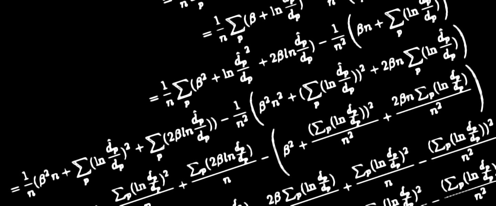

***

Over the last few months I have been working in (monocular) depth estimation for my Master's Thesis. When I started digging into commonly used loss functions, I came across the Scale Invariant Log Loss. This function was presented by Eigen et al. in *Depth Map Prediction from a Single Image using a Multi-Scale Deep Network* ([arXiv](https://arxiv.org/pdf/1406.2283.pdf)) and it is extensively used (usually in conjunction with additional scale-dependant terms) to train and evaluate depth prediction models. The catch about this function is that the scale of the predicted output does not affect its magnitude. When I first read that, I wanted to take a look at the mathematical proof of the scale invariance, but could not find any already written. Therefore, this post tries to relieve the mathematical itch of those in my position.

This should be a short post, but you can jump straight to the proof clicking [here](#the-actual-mathematical-proof).

***

# A little context, as a treat

Before going into the mathematical detail the meaning of scale invariance should be explained. Monocular Depth Estimation (recovering the three-dimensional information lost when projecting a 3D scene such as the real world into a 2D space such as an image) is an ill posed problem. This means that it has infinite geometrical solutions, as an infinite number of scenes can be projected in the same 2D representation given that a relation between their distance and their scale exists. An example of this problem can be seen below, where the two cubes produce the same image, even though their scale is different.

<figure align="center">
  
</figure>

What a scale invariant loss function does is calculate an error magnitude that does not take into account the scale discrepancy between the ground truth annotation and the output predicted by our model. It only considers the relative depth of each set of values.

One last thing to mention is that the previously mentioned paper didn't actually proposed a totally scale-invariant loss. It proposed a function that can be tweaked to change the influence of the scale. The original equation is:

$$
L(\hat{d}, d) = \frac{1}{n}\sum_{p} (\ln{\hat{d_p}} - \ln{d_p})^2 - \frac{\lambda}{n^2} \left( \sum_{p} (\ln{\hat{d_p}} - \ln{d_p}) \right)^2 \\
$$

And citing Eigen et al. (emphasis mine):

> Setting λ = 0 reduces to elementwise L2, **while λ = 1 is the
scale-invariant error exactly**. We use the average of these, i.e. λ = 0.5, finding that this produces
good absolute-scale predictions while slightly improving qualitative output.

***

# The actual mathematical proof

Without further ado, here comes the math.

In the first equation we have the Scale Invariant Log Loss with λ = 1. The ground truth depth measure in each pixel is denoted by $$d_p$$, and the predicted depth by $$\hat{d_p}$$. The number of pixels in each image is $$n$$.

$$
L(\hat{d}, d) = \frac{1}{n}\sum_{p} (\ln{\hat{d_p}} - \ln{d_p})^2 - \frac{1}{n^2} \left( \sum_{p} (\ln{\hat{d_p}} - \ln{d_p}) \right)^2 \\
$$

First step is to introduce $$\alpha$$ as the scaling factor, multiplying both $$\hat{d_p}$$ terms.

$$
= \frac{1}{n}\sum_{p} (\ln{\alpha \hat{d_p}} - \ln{d_p})^2 - \frac{1}{n^2} \left( \sum_{p} (\ln{\alpha \hat{d_p}} - \ln{d_p}) \right)^2 \\
$$

Operate on the logarithms...

$$
= \frac{1}{n}\sum_{p} (\ln{\alpha} + \ln{\frac{\hat{d_p}}{d_p}})^2 - \frac{1}{n^2} \left( \sum_{p} (\ln{\alpha} + \ln{\frac{\hat{d_p}}{d_p}}) \right)^2 \\
$$

Rename ln $$\alpha$$ (which is constant) as $$\beta$$...

$$
= \frac{1}{n}\sum_{p} (\beta + \ln{\frac{\hat{d_p}}{d_p}})^2 - \frac{1}{n^2} \left( \sum_{p} (\beta + \ln{\frac{\hat{d_p}}{d_p}}) \right)^2 \\
$$

Expand the first binomial expression and operate on the second summatory...

$$
= \frac{1}{n}\sum_{p} (\beta^2 + \ln{\frac{\hat{d_p}}{d_p}}^2 + 2 \beta ln{\frac{\hat{d_p}}{d_p}}) - \frac{1}{n^2} \left( \beta n + \sum_{p} (\ln{\frac{\hat{d_p}}{d_p}}) \right)^2 \\
$$

Operate on the first summatory and expand the binomial of the second term...

$$
= \frac{1}{n} (\beta^2 n + \sum_{p}(\ln{\frac{\hat{d_p}}{d_p}})^2 + \sum_{p}(2 \beta ln{\frac{\hat{d_p}}{d_p}})) - \frac{1}{n^2} \left( \beta^2 n^2 + (\sum_{p} (\ln{\frac{\hat{d_p}}{d_p}}))^2 + 2 \beta n \sum_{p} (\ln{\frac{\hat{d_p}}{d_p}}) \right) \\
$$

Operate with the number of pixels' fractions...

$$
= \beta^2 + \frac{\sum_{p}(\ln{\frac{\hat{d_p}}{d_p}})^2}{n} + \frac{\sum_{p}(2 \beta ln{\frac{\hat{d_p}}{d_p}})}{n} - \left( \beta^2 + \frac{(\sum_{p} (\ln{\frac{\hat{d_p}}{d_p}}))^2}{n^2} + \frac{2 \beta n \sum_{p} (\ln{\frac{\hat{d_p}}{d_p}})}{n^2} \right) \\
$$

Reorder the terms for easier simplification...

$$
= \beta^2 - \beta^2 + \frac{\sum_{p}(2 \beta ln{\frac{\hat{d_p}}{d_p}})}{n} - \frac{2 \beta \sum_{p} (\ln{\frac{\hat{d_p}}{d_p}})}{n} + \frac{\sum_{p}(\ln{\frac{\hat{d_p}}{d_p}})^2}{n} - \frac{(\sum_{p} (\ln{\frac{\hat{d_p}}{d_p}}))^2}{n^2} \\
$$

Simplify the terms when possible...

$$
= \frac{\sum_{p}(\ln{\frac{\hat{d_p}}{d_p}})^2}{n} - \frac{(\sum_{p} (\ln{\frac{\hat{d_p}}{d_p}}))^2}{n^2} \\
$$

And finally, change the logarithms' representation again to get the original expression (!).

$$
= \frac{1}{n}\sum_{p} (\ln{\hat{d_p}} - \ln{d_p})^2 - \frac{1}{n^2} \left( \sum_{p} (\ln{\hat{d_p}} - \ln{d_p}) \right)^2 \\
$$

***

That's it! As I promised, a short post. Thank you for reading!

***

Related links
+ [Depth Map Prediction from a Single Image using a Multi-Scale Deep Network](https://arxiv.org/pdf/1406.2283.pdf)
+ [Wikipedia article for Well-posed problems](https://en.wikipedia.org/wiki/Well-posed_problem)

***

<!--https://github.com/mathjax/MathJax
https://benlansdell.github.io/computing/mathjax/-->