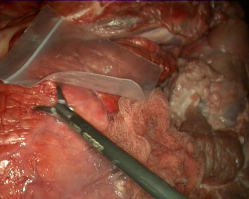
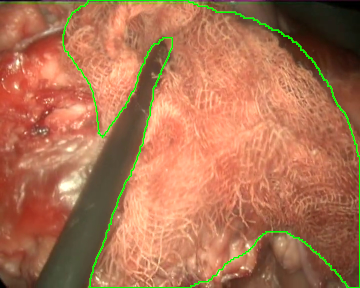

***

This post presents a dataset I worked on a few years ago that we (part of the research institute I am currently working at) have recently [published](https://www.mdpi.com/1424-8220/22/14/5180). The dataset is formed by images and videos of simulated surgical procedures with gauze presence that have been captured using an endoscope. Alongside the images and the videos, we also include hand traced semantic segmentation masks for over 4K frames in the dataset.

***

# The problem

In laparoscopic surgery the surgeons make a set of small incisions in the body of the patient. These incisions are then used to introduce an endoscope (basically a camera) and different tools, avoiding the need for open surgery. However, this methodology creates a disconnection between the surgeon and the insides of the patient, as tactile and visual-depth feedback is greatly reduced. To remediate this, different research lines explore the use of autonomous/collaborative robots during laparoscopic surgeries. These lines of research require advanced automatic perception of the laparoscopic environment, which has been partially tackled in, for example, the work of [Surikaya et al.](https://ieeexplore.ieee.org/document/7847313), [Shvets et al.](https://ieeexplore.ieee.org/document/8614125) or [Jo et al.](https://www.mdpi.com/2076-3417/9/14/2865), where surgical tool detection is explored. Nonetheless, gauze detection is still relatively unexplored, although gauzes are a very common element in laparoscopic surgical procedures. In light of the lack of dataset and methods to enhance medical robots' perception systems, we decided to simulate various laparoscopic scenarios to create a dataset with gauze annotations, allowing the development of more complex systems that can interact with gauzes.

Furthermore, the task of gauze detection is not limited to robotic perception, as other applications such as gauze retention avoidance (to reduce the risk of gossypiboma) or video indexing would also benefit from models capable of locating gauzes in a video signal.

***

# The dataset

The dataset is [available in Zenodo](https://zenodo.org/record/6637871) and has 42 video files (30 with gauze presence, ~33 minutes; and 12 without gauze presence, ~13 minutes) collected in different settings. 

As specific conditions are extremely hard to fabricate during real surgeries, the videos have not been recorded in laparoscopic surgery operations on real patients. Instead, we used a laparoscopic simulator and animal organs to recreate diverse operation scenarios, which allow us to test the gauze detection algorithms under specific conditions such as presence of other tools, different degrees of stains in the gauzes, camera movement, etc. As a direct consequence of this, the scenarios in the dataset include the following situations: absence of gauze, absence of gauze with tools presence, presence of a unique clean gauze and tools, presence of a unique stained gauze and tools, and presence of multiple gauzes in different states. You can check some random samples from the videos below:

<div class="container">
  <div class="row">
    <div class="col"></div>
    <div class="col"></div>
    <div class="col"></div>
  </div>
  <div class="row">
    <div class="col"></div>
    <div class="col"></div>
    <div class="col"></div>
  </div>
</div>

Once the videos were correctly recorded, we selected a subset of them (18 out of the 30 videos with gauzes) and sampled them every 10 frames, which resulted in 4003 images. These images, were later hand annotated with masks that correspond to the surgical gauzes, enabling the training of supervised models, both for segmentation and for object detection (as it is trivial to calculate bounding boxes once the segmentation masks are available). Again, some samples from the annotated dateset are shown below (outline of the mask drawn in green):

<div class="container">
  <div class="row">
    <div class="col"></div>
    <div class="col"></div>
    <div class="col"></div>
  </div>
  <div class="row">
    <div class="col"></div>
    <div class="col"></div>
    <div class="col"></div>
  </div>
</div>

Finally, as consecutive frames from the same video may be too similar and pollute the evaluation set, random splits have been discarded to generate the train and the evaluation sets. Instead, the dataset was split video-wise ensuring equilibrium between tool presence, blood impregnation and movement of the endoscope in both partitions.

***

# Further info

The paper also includes a set of simple baselines for different tasks to validate the dataset: object detection using YOLOv3, coarse segmentation using various convolutional backbones, and semantic segmentation with a U-Net architecture. You can check [the paper](https://www.mdpi.com/1424-8220/22/14/5180) for more info on these approaches.

***

Last but not least, please cite the paper if you use the dataset!

```
@Article{s22145180,
	AUTHOR = {Sánchez-Brizuela, Guillermo and Santos-Criado, Francisco-Javier and Sanz-Gobernado, Daniel and de la Fuente-López, Eusebio and Fraile, Juan-Carlos and Pérez-Turiel, Javier and Cisnal, Ana},
	TITLE = {Gauze Detection and Segmentation in Minimally Invasive Surgery Video Using Convolutional Neural Networks},
	JOURNAL = {Sensors},
	VOLUME = {22},
	YEAR = {2022},
	NUMBER = {14},
	ARTICLE-NUMBER = {5180},
	URL = {https://www.mdpi.com/1424-8220/22/14/5180},
	ISSN = {1424-8220},
	DOI = {10.3390/s22145180}
}
```

***

Related links
+ [Data repository on Zenodo](https://zenodo.org/record/6637871)
+ [Open Access paper](https://www.mdpi.com/1424-8220/22/14/5180)

***