

***

This will be a short summary of the content of my Master's Thesis, as the original document is in Spanish. If you want to take a look, the manuscript is available [here](https://github.com/guillesanbri/tfm-latex/blob/v1.0.0/main.pdf). I will assume familiarity with transformers and attention mechanisms over the post, if you don't have any, imo, [The Illustrated Transformer](https://jalammar.github.io/illustrated-transformer/) is the perfect place to start.

During this project I proposed and implemented architecture modifications on [DPT](https://arxiv.org/abs/2103.13413), a transformed-based monocular depth estimation model proposed by Ranftl et al., to accelerate inference and reduce the model size. Once the modifications were implemented, I fine-tuned all the possible architecture combinations on the KITTI dataset to later compare the effects of each alteration both quantitatively and qualitatively.

My fork of the original DPT repo is [here](https://github.com/guillesanbri/DPT/tree/v1.0.0-tfm) and the resulting models are available [here](https://zenodo.org/record/6574941).

***

**Table of Contents**

* TOC 
{:toc}

***

<iframe src="https://giphy.com/embed/Jlz768kfQasa5Q9K8C" width="100%" height="100%" style="position:absolute" frameBorder="0" class="giphy-embed" allowFullScreen></iframe>

<iframe src="https://giphy.com/embed/Jlz768kfQasa5Q9K8C" width="480" height="278" frameBorder="0" class="giphy-embed" allowFullScreen></iframe>

<iframe src='https://gfycat.com/ifr/EquatorialAltruisticIrishdraughthorse' frameborder='0' scrolling='no' width='100%' height='100%' style='position:absolute;top:0;left:0;' allowfullscreen></iframe>

***

# Introduction

***

Although there are multiple ways to capture 3D information (LiDAR, TOF cameras, stereo vision systems, etc.), projecting a 3D scene into a single 2D image using a camera results in a loss of the depth information.

The human visual system, however, is perfectly capable of identifying which objects are further than others using only one eye. This is due to a set of signals that we learn called monocular cues which include relative size of objects, occlusion, convergence of parallel lines, color tone changes, shadows, etc. 

Programming these kinds of features using traditional computer vision approaches would be extremely complicated, but neural networks have proven to be able to learn them and recover an estimation of the depth from a single (monocular) 2D image.

The objectives of this work included the review and study of the state of the art in monocular depth estimation, as well as the proposal and comparison of various architecture modifications on one of the SOTA models to accelerate its inference and reduce its size.

***

# Theoretical framework

***

## Depth estimation

Depth estimation tries to capture depth information from the environment. There are various ways of doing this:

- Geometric solutions: As in Structure from Motion (SfM), where multiple images from a single camera are used; or stereovision, where multiple cameras are used.
- Hardware solutions: Such as LiDAR sensors, Time of Flight cameras, or Structured light systems.

However, this project deals with **monocular** depth estimation, which means that the available information is a single image captured by a standard camera. There are multiple self-supervised and semi supervised learning approaches [[Zhou et al.](https://arxiv.org/abs/1704.07813), [Wang et al.](https://arxiv.org/abs/1712.00175), [Tosi et al.](https://arxiv.org/abs/1904.04144), [Smolyanskiy et al.](https://arxiv.org/abs/1803.09719), [Xu et al.](https://arxiv.org/abs/1910.06727)], but supervised learning methods still provide the best results.

Supervised approaches are often based on encoder-decoder convolutional architectures [[Eigen et al.](https://arxiv.org/abs/1406.2283)] with different modifications such as including output consistency using the gradients on the resulting predictions [[Eigen et al.](https://arxiv.org/abs/1411.4734)]; or guiding information through the network [[Lee et al.](https://arxiv.org/abs/1907.10326)]. Furthermore, there are also approaches that use adversarial learning systems where the discriminator tries to distinguish between the generated and the real depth data [[Jung et al.](https://ieeexplore.ieee.org/document/8296575)].

Over the last years, however, transformer architectures have proven to be capable of learning from vast amounts of data to configure their own inductive biases. As expected after their results in other computer vision tasks, transformer-based models oriented to monocular depth estimation have also been proposed [[Ranftl et al.](https://arxiv.org/abs/2103.13413), [Bhat et al.](https://arxiv.org/abs/2011.14141)].

DPT, one of these transformer-based models, was the one chosen to be modified along the project.

## DPT

The DPT architecture is conformed by a Hybrid Vision Transformer [[Dosovitskiy et al.](https://arxiv.org/abs/2010.11929)] encoder, basically a transformer with a convolutional network (in this case, a ResNet-50) which extracts feature maps that are then used to build the input tokens of the transformer; and a convolutional decoder. The decoder fuses representations from four points of the encoder (two from the convolutional encoder and two from the transformer attention blocks) called hooks. Once these representations are fused, a prediction head produces the final depth estimation. A simplified diagram of the model is available in Figure 1.

<figure align="center">
  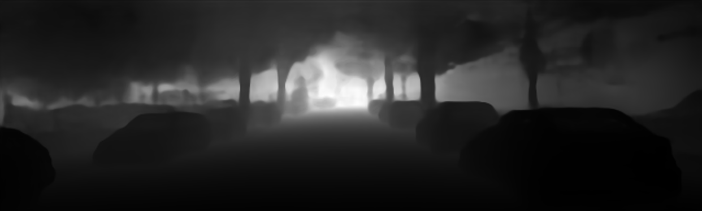
  <figcaption><i>Figure 1: DPT architecture overview.</i></figcaption>
</figure>

One of the main problems of transformers is the time and space complexity of the attention mechanism, which is $$O(n^2)$$ where $$n$$ is the number of tokens. This means that if $$n$$ is also quadratic (as when working with images/feature maps), the memory and time requirements scale up fast. To remediate this, different efficient attention methods have been proposed in the literature, for example:

## Efficient attention

- Fixed Patterns: Where the attention mechanisms input sequences are shortened accessing its elements in blocks ([Blockwise Attention](https://arxiv.org/abs/1911.02972), [Local Attention](https://arxiv.org/abs/1906.05909)); in previously defined intervals ([Sparse Transformer](https://arxiv.org/abs/1904.10509), [Longformer](https://arxiv.org/abs/2004.05150)); or pooling the sequences elements ([Compressed Attention](https://arxiv.org/abs/1801.10198)).
- Learnable Patterns: Similar to the previous case, but this time, the access patterns are learned during training ([Reformer](https://arxiv.org/abs/2001.04451), [Routing Transformer](https://arxiv.org/abs/2003.05997)).
- Rank reduction: These approaches focus on reducing the rank of the tensor produced by the attention mechanisms, as in [Linformer](https://arxiv.org/abs/2006.04768).

Although there are various efficient attention mechanisms, the [Performer by Choromanski et al.](https://arxiv.org/abs/2009.14794) was the one chosen to be studied in the architecture modifications. This approach modifies the multiplication order of the Q, K and V matrices of the standard attention mechanism.

Given that $$n$$ is the number of tokens of size $$d$$ in the input sequence, if instead of multiplying $$(Q \times K^T) \times V$$, we multiply $$Q \times (K^T \times V)$$, the multiplied dimensions would be $$(n \times d) \times ((d \times n) \times (n \times d))$$ instead of $$((n \times d) \times (d \times n)) \times (n \times d)$$. This means that the number of operations is no longer $$2n^2d$$ (standard attention) and becomes $$2d^2n$$ (performer attention), making the computational cost linear with n $$(O(n))$$ if $$n >>>> d$$. This mechanism is represented in Figure 2.

However, there is an important problem with this change: a softmax function is applied to matrix $$(Q \times K^T)$$ to obtain matrix $$A$$ before multiplying it by $$V$$. As the softmax function is nonlinear, this breaks the associative property of matrix multiplication. To solve this, the authors of the Performer paper present a kernelization method that approximates the results of applying the softmax function with two matrices $$Q'$$ and $$K'$$.

<figure align="center">
  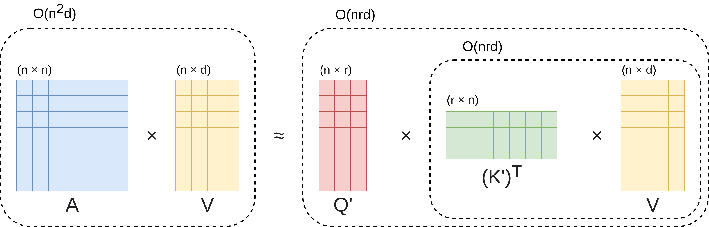
  <figcaption><i>Figure 2: Approximation and association of the Performer attention mechanism.</i></figcaption>
</figure>

***

# Material and methods

***

## Software and Hardware

The software stack used during this project includes [PyTorch](https://pytorch.org/), [timm](https://github.com/rwightman/pytorch-image-models), the [original DPT repo](https://github.com/isl-org/DPT) and some of the [efficient attention implementations of Phil Wang](https://github.com/lucidrains) for the Deep Learning/GPU part of things; [OpenCV](https://opencv.org/), [NumPy](https://numpy.org/), and [Seaborn](https://seaborn.pydata.org/) to manipulate images and visualize graphs; [fvcore](https://github.com/facebookresearch/fvcore) to measure FLOPs; [Weights and Biases](https://wandb.ai/site) to manage and track the training of the models in different computers; lastly, Docker and the NVIDIA Container Toolkit to manage the installation and replication of the training environment in the cloud.

The development was carried out in a desktop computer (AMD Ryzen 7 3800x, 32GB DDR4, RTX 3080 8GB) and the training of the models was parallelized between said computer and various Google Cloud instances (Intel Xeon, Tesla T4 16 GB, 15GB).

The deployment of new instances and the training processes were automatically configured using GCP, Docker and WandB. I intend to write another post explaining this!

## Training

To train the different models that resulted from the proposed modifications, the weights from the original model trained in the MIX6 dataset were used when possible, as not all the layers and blocks that were modified had the same parameters. The pretrained models were then fine-tuned on the KITTI dataset, following the Eigen Split [[Eigen et al.](https://arxiv.org/abs/1406.2283)], which is available [here](https://github.com/nianticlabs/monodepth2/tree/master/splits) (*eigen_full* directory).

As the training script is not available in the original paper repo, a training regime was programmed with horizontal random mirroring as data augmentation, AdamW as the optimizer $$(lr=1e-5, \beta_1=0.9, \beta_2=0.999, \epsilon=1e-8, wd=0.01)$$ and gradient clipping set to $$0.5$$. Models were trained for $$20$$ epochs.

The loss function used to fit the models was the one proposed in *Depth Map Prediction from a Single Image using a Multi-Scale Deep Network* [[Eigen et al.](https://arxiv.org/abs/1406.2283)] with $$\lambda = 0.5$$ to balance the scale invariant term. More info on the scale invariance [here]({{site.baseurl}}/Scale-Invariant-Loss/).

>For each pixel $$p$$, $$d_p$$ is the depth ground truth value and $$\hat{d}_p$$ is the predicted depth value.

$$
L(\hat{d}, d) = \frac{1}{n}\sum_{p} (\ln{\hat{d_p}} - \ln{d_p})^2 - \frac{0.5}{n^2} \left( \sum_{p} (\ln{\hat{d_p}} - \ln{d_p}) \right)^2 \\
$$

Altogether, 36 different models were fine-tuned on KITTI, summing up over 1800 GPU compute hours.

## Evaluation metrics

To evaluate the performance of the models during and after training, several commonly used metrics were calculated, among them:

>$$T$$ is the number of available pixels with depth information. For each pixel $$p$$, $$d_p$$ is the depth ground truth value and $$\hat{d}_p$$ is the predicted depth value.

>As KITTI has sparse annotations, the predictions were masked to only take into account the pixels with available ground truth.

- **δ**: Accuracy under a threshold. Threshold values $$ = (1.25^1, 1.25^2, 1.25^3)$$.

$$
\% \ of \ p \in T : max(\frac{\hat{d}_p}{d_p},\frac{d_p}{\hat{d_p}}) = \delta < threshold 
$$

- **Abs. Rel.**: Mean Absolute Value of the Relative Error.

$$
\frac{1}{T}\sum_{p\ \in\ T} \frac{|d_p - \hat{d}_p|}{d_p}
$$

- **Sq. Rel.**: Mean Squared Relative Error.

$$
\begin{equation}
\label{eqn:sq_rel}
\frac{1}{T}\sum_{p\ \in\ T} \frac{(d_p - \hat{d}_p)^2}{d_p}
\end{equation}
$$

- **RMSE**: Linear Root Mean Squared Error.

$$
\begin{equation}
\label{eqn:rmse}
\sqrt{\frac{1}{T}\sum_{p\ \in\ T} (d_p - \hat{d}_p)^2}
\end{equation}
$$

- **RMSELog**: Logarithmic Root Mean Squared Error.

$$
\sqrt{\frac{1}{T}\sum_{p\ \in\ T} (\ln{d_p} - \ln{\hat{d}_p})^2}
$$

- **SILog**: Scale Invariant Logarithmic Error ([Bonus: Mathematical proof]({{site.baseurl}}/Scale-Invariant-Loss/)).

$$
\sqrt{
	\frac{1}{T} \sum_{p\ \in\ T} (\ln{\hat{d_p}} - \ln{d_p})^2
	-
	{\left(\frac{1}{T} \sum_{p\ \in\ T} \ln{\hat{d_p}} - \ln{d_p}\right)}^2
} * 100
$$

- **FPS**: Frames per second the model can process (with batch size = 1). Hardware dependant.

- **FLOPs**: Number of floating point operations during inference. Hardware independent.

- **Model size**: Memory space the model takes.

***

# Architecture modifications

***

## Internal working resolution

Although a very basic one, the first proposed modification was to introduce two new blocks that modified the input resolution. The first block, placed just before the network, reduced the input size, and the second block, situated after the model prediction head, increased the output size to match the original image size, as shown in Figure 3.

<figure align="center">
  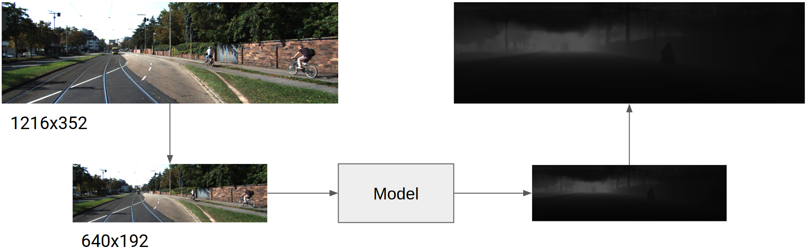
  <figcaption><i>Figure 3: Image resolution alteration in the modified DPT.</i></figcaption>
</figure>

## Efficient Attention

The second modification was the alteration of the attention blocks. As mentioned before, the attention block of the **Performer** would be studied. This attention mechanism has an additional advantage, which is that as stated by the authors in the paper, standard attention parameters can be used directly in the Performer attention block, requiring only a small tuning.

## Transformer head count

Based on the intuition presented on [*Are Sixteen Heads Really Better than One?*](https://arxiv.org/abs/1905.10650), the number of heads in the attention blocks and its influence on the DPT architecture was also studied. Three different variants are presented below, one with only **1** attention head, the original set up of **12** attention heads, and an additional overdimensioned set up of **24** attention heads.

The authors of the mentioned paper conclude that reducing the number of heads reduces performance more in Cross-Attention blocks than in Self-Attention blocks. As DPT only has Self-Attention blocks on the ViT encoder, a non-dramatic exchange between performance deterioration and faster inference was expected.

## Transformers hooks and removal of posterior attention blocks

As another kind of structured pruning, the number of attention blocks was also altered. This served a double purpose: First, the size of the model would be reduced as there was no point in storing said parameters; and second, the inference time would be affected as well, since the calculations of every block after the last hooked attention block could be cut off. This implementation detail contrasts with the original DPT implementation, where the input goes all the way through the full Vision Transformer. A schema of this behavior is displayed in Figure 4.

<figure align="center">
  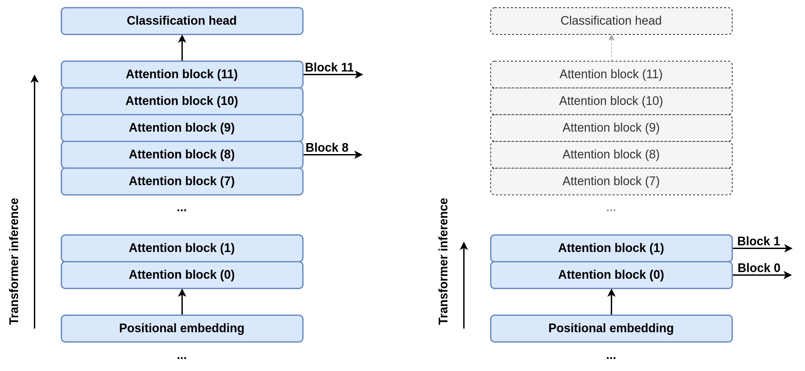
  <figcaption><i>Figure 4: Change in the hooks and the number of attention blocks.</i></figcaption>
</figure>

The possible values studied for the transformer hooks were blocks **0 and 1**, **2 and 5**, and the original configuration, **8 and 11**.

## Convolutional backbone

The last proposed modification was to change the convolutional backbone of the Hybrid Vision Transformer from a **ResNet-50** to a **EfficientNet-B0**, characterized by its Mobile Inverted Bottleneck Residual Convolutions (a convolution block presented in [MobileNetV2](https://arxiv.org/abs/1801.04381)) and its Squeeze-and-Excitation blocks (from [SENet](https://arxiv.org/abs/1709.01507)).

In order to take advantage of the attention parameters pretrained on MIX6, as the number of feature maps from the EfficientNet-B0 backbone and its size was not the same as with the ResNet-50 backbone, a transpose convolution layer was included to change the number of channels and its size.

As no EfficientNet-B0 parameters pre-trained on MIX6 were available, the KITTI fine tuning started with Imagenet-pretrained parameters.

***

# Results and discussion

***

As previously mentioned, the cartesian product of all possible architecture modifications produced a total of 36 models (2 Attention Blocks x 3 Head counts x 3 Hooks position x 2 Convolutional backbones) that were fine tuned on KITTI, all of them with the reduced internal working resolution, due to computing constraints.

However, two of these modifications had negative outcomes:

**Convolutional backbones**

The models with the EfficientNet-B0 backbone presented clear signs of overfitting, as the results of the models in the training set were similar to those of the equivalent model with the ResNet-50 while the metrics in the validation set were clearly worse. 

One of the hypothesized causes of this overfitting was that while the ResNet-50 weights were pretrained on the MIX6 dataset, the EfficientNet-B0 parameters were pre-trained on Imagenet. To check if this was the cause of the overfitting, an additional model with a ResNet-50 pretrained on Imagenet was fine tuned on KITTI, but while it indeed resulted in slightly worse results, it did not show the same overfitting as its EfficientNet-B0 counterpart.

Hence, these models were discarded from the final results study, and further experimentation would be needed to solve this overfitting.

**Efficient attention mechanisms**

Another problem that arose when comparing the trained models was that while the Performer attention mechanisms performed slightly worse than the standard attention mechanism, the KITTI images (specially the reduced ones) took no advantage of the reduced time complexity, as the number of tokens in the sequences was too small to overcome the overhead of the matrix approximation. This is shown both in Figure 5 and Figure 6. 

Figure 5 shows that the inference speed with the non reduced images is only a little bit faster in the case of the Performer, but that when working with reduced images, this increment in inference speed disappears.

<figure align="center">
  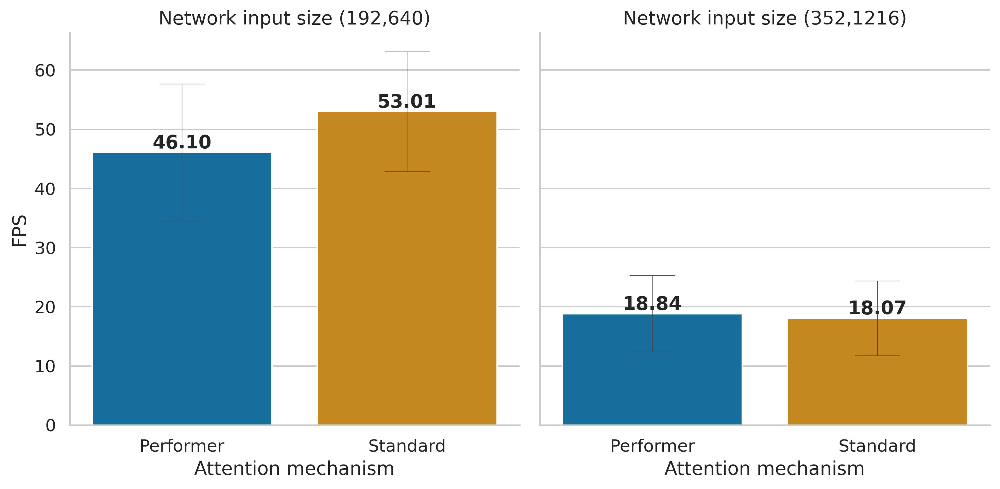
  <figcaption><i>Figure 5: Mean FPS of the models based on their attention mechanism and their internal working resolution. Gray bars represent the standard deviation of the measurements.</i></figcaption>
</figure>

On the other hand, Figure 6 shows the relationship between the Performer and the Standard attention mechanism time complexities, clearly illustrating that when working with a reduced number of tokens (graph detail on the left) the overhead of the performer operations surpasses its linear complexity.

<figure align="center">
  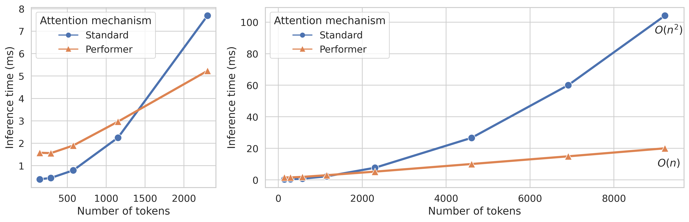
  <figcaption><i>Figure 6: Comparison of the complexity and the inference time of a single attention block using both the standard attention mechanism and the Performer attention mechanism. A detail of the inference times for short input sequences is shown on the left.</i></figcaption>
</figure>

Based on the negative consequences of introducing the efficient attention block when dealing with the KITTI dataset, this modification was also left out. Nonetheless, as mentioned in the future work section, experiments with higher resolution imagery (e.g. from some medical imaging modalities or satellites) would be really interesting.

## Quantitative results

When analyzing the metrics of each trained model on the Eigen split validation set in order to choose a final model to evaluate on the test set, we can see, for example in the SILog metrics (Figure 7), a clear relationship between the transformer hooks selection and the model performance. On the other hand, the constant gap between the two attention mechanisms  and the much smaller difference based on the number of attention heads are also visible.

<figure align="center">
  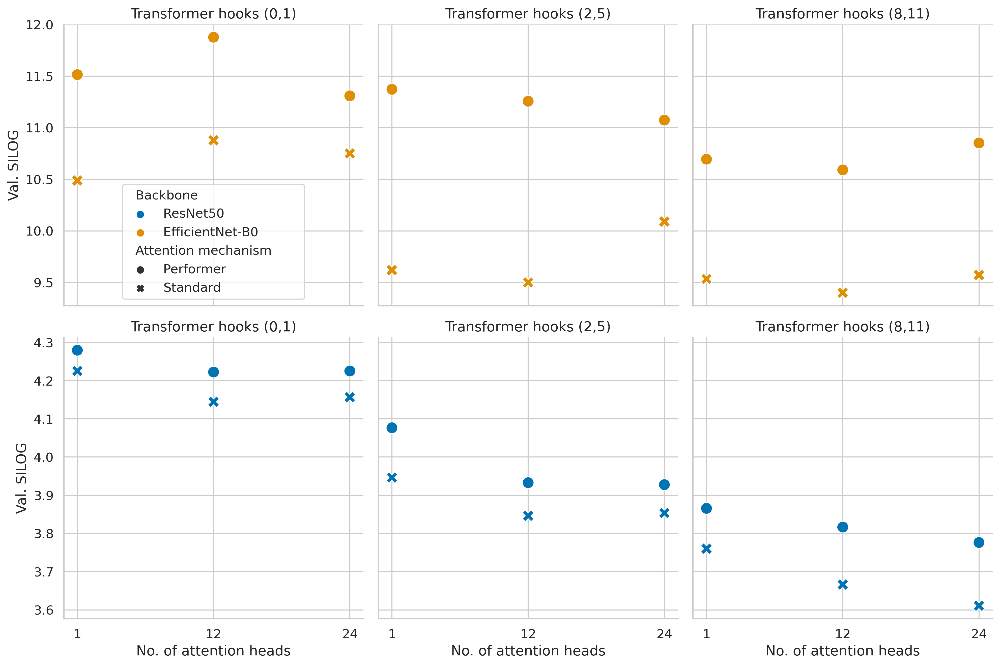
  <figcaption><i>Figure 7: SILog of the validation set for each one of the 36 trained models. Lower is better.</i></figcaption>
</figure>

As expected, the number of GFLOPs during inference (Figure 8) is directly correlated with the number of attention blocks and attention heads. Furthermore, the (failed) EfficientNet-B0 backbone also shows a notably smaller number of GFLOPs.

<figure align="center">
  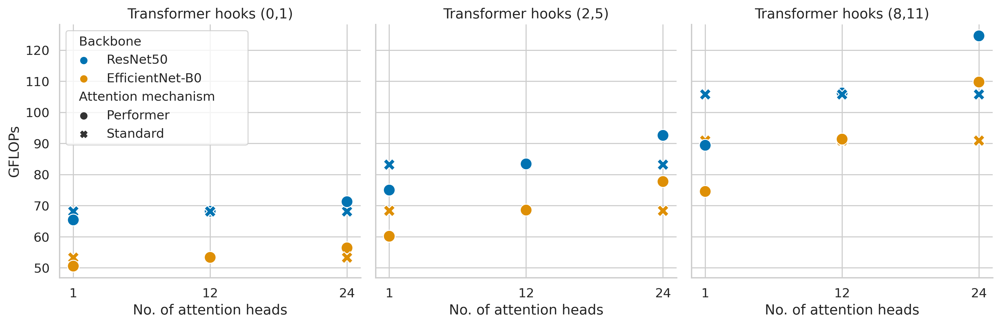
  <figcaption><i>Figure 8: Number of floating point operations needed to infer depth on a given image based on the model configuration. Lower is better.</i></figcaption>
</figure>

## Qualitative results

Qualitatively, although no dramatic changes are shown, the inner resolution and the transformer hooks both alter the output. In the first case (Figure 9) the reduced resolution (c) shows a noisier edge on the details, as visible in the cars of the cropped section.

<figure align="center">
  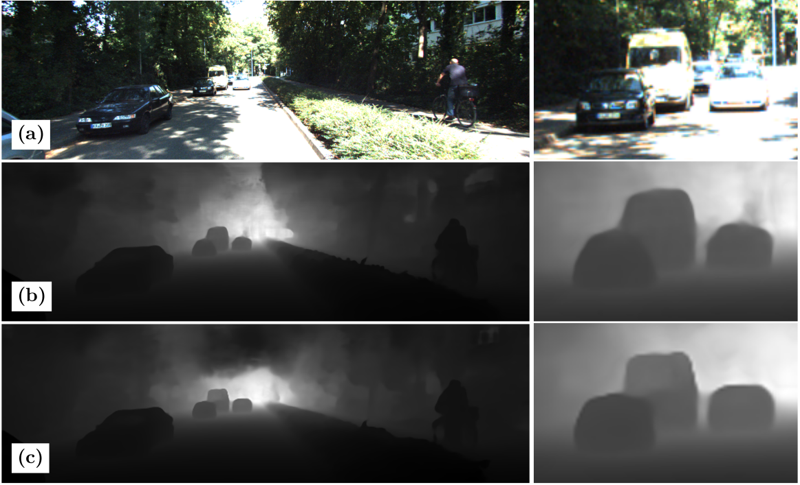
  <figcaption><i>Figure 9: Results based on the input resolution. (a) Model input and detail. (b) Output from the original DPT model (no input resolution reduction). (c) Output from the equivalent model with the reduced input resolution.</i></figcaption>
</figure>

Likewise, while the general image doesn't show big differences, details such as small objects in the image (e.g. far away traffic signals) are affected by the alterations of the transformer hooks (Figure 10).

<figure align="center">
  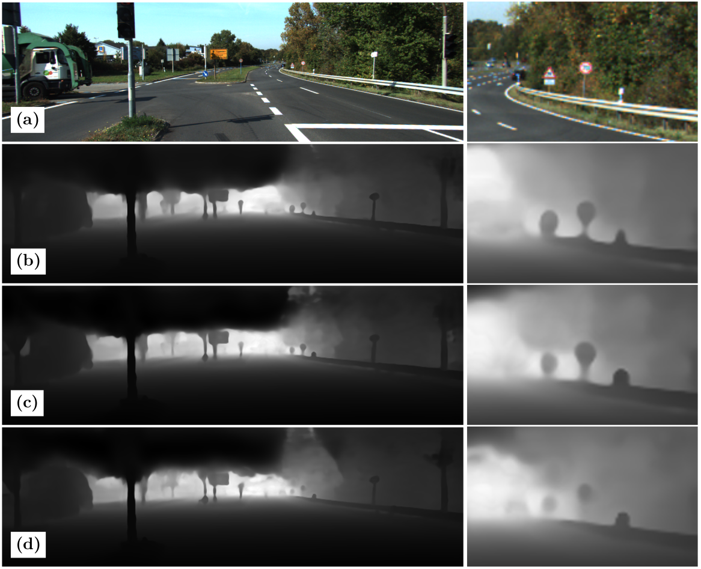
  <figcaption><i>Figure 10: Results based on the transformer hooks. (a) Model input and detail. (b) Output from the DPT model with the reduced input resolution and hooks [8, 11]. (c) Output from the DPT model with the reduced input resolution and hooks [2, 5]. (d) Output from the DPT model with the reduced input resolution and hooks [0, 1].</i></figcaption>
</figure>

## Comparison with the state of the art

Moving on to the test set of the KITTI Eigen Split, Table 1 compares four state of the art models ([Global-Local Path Networks](https://arxiv.org/abs/2201.07436), [Adabins](https://arxiv.org/abs/2011.14141), [Big to Small](https://arxiv.org/abs/1907.10326) and the original [DPT-Hybrid](https://arxiv.org/abs/2103.13413)) with two of the modifications from this study: **DPT-H-r**: A version of DPT Hybrid with the reduced input resolution; and **A**: The DPT Hybrid modified to have only **one head**, the transformers **hooks fixed to blocks 0 and 1**, and **reduced resolution**. This last model keeps the ResNet-50 convolutional backbone and the standard attention mechanism.

<figure align="center">
  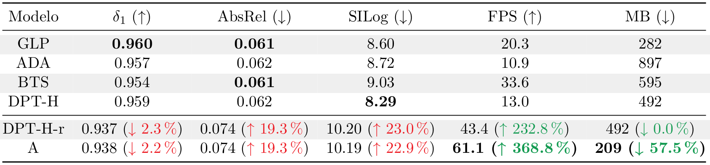
  <figcaption><i>Table 1: Comparison of different state of the art models. Metrics from the test set of the KITTI Eigen Split. Inference times were calculated using mixed precision on the desktop computer listed on the Hardware section. Increments and decrements are calculated for the DPT modifications with respect to the original architecture. </i></figcaption>
</figure>

In Table 1, we can see a great increase in the inference speed of the model A when compared to the original DPT-H, which multiplies its inference FPS by almost 5x. Likewise, the model size is effectively reduced to less than half of the size of the original model. 

Obviously, this comes with a trade off in the quality metrics, which drop around 20%. While this loss of performance is not trivial, at the time of evaluation, the two presented models occupied the eighth position in the [Eigen Split Benchmark of Papers with Code](https://paperswithcode.com/sota/monocular-depth-estimation-on-kitti-eigen), so the models are still competitive when compared with other architectures.

As a last comparison, the results from the **DPT-H** and the **A** models on a video recorded at my uni zone (mimicking the KITTI images nature, but with no further fine-tuning) are shown.

***

**Original DPT (DPT-H)**

<iframe src='https://gfycat.com/ifr/FrayedUnlawfulLeafbird' frameborder='0' scrolling='no' width='100%' height='100%' style='position:absolute;top:0;left:0;' allowfullscreen></iframe>

***

**Modified DPT (A)**

<iframe src='https://gfycat.com/ifr/EquatorialAltruisticIrishdraughthorse' frameborder='0' scrolling='no' width='100%' height='100%' style='position:absolute;top:0;left:0;' allowfullscreen></iframe>

***

# Future work

***

As stated along this summary, various things have been left out as future work due to time and compute power restrictions. More specifically:

- **Further optimization**: While the resulting model is indeed faster and smaller, all the modifications are topological and multiple optimization techniques such as quantization or layer fusion could still be applied to accelerate the model and reduce its size further.
- **Additional models**: To present a more robust comparison, it would be necessary to train the modified models with the original image resolution to validate how the size resolution affects the presented models. Additionally, the training on MIX6 of the non-pretrained parts and the mitigation of the EfficientNet-B0 overfitting is still pending.
- **Practical applications and efficient attention**: As the efficient attention mechanisms have not been exploited, the utilization of the model in a higher resolution problem, such as a satellite imagery mapping application, would be a great way to take advantage of the complexity reduction.

***

Thanks you for reading!

***

Related links
+ [Original DPT paper](https://arxiv.org/abs/2103.13413)
+ [Original DPT repo](https://github.com/isl-org/DPT)
+ [Master's Thesis Manuscript](https://github.com/guillesanbri/tfm-latex/blob/v1.0.0/main.pdf)

***
