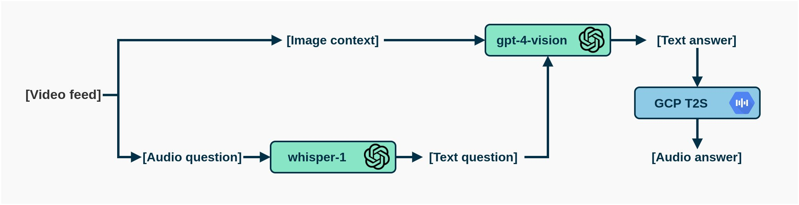

***

I've wanted to develop something to help blind people understand their surroundings since I first came across Image Captioning models. Back then, the tech wasn't quite there — but with multimodal LLMs, that has definitely changed! 

In this post I'll be sharing **TiresIAs**, an open-source AI-driven assistant that takes voice queries about the environment and generates audible responses.

Although primarily designed to improve accessibility, TiresIAs could also be useful for general voice-based interaction with visual content.

> Technically, TiresIAs is quite simple. It's just a set of API calls held together with duct tape (a.k.a., Python code). Hopefully it serves as inspiration and proof of how incredibly easy it's getting to create very powerful vision/language systems.

You can hear TiresIAs answering a few questions in the video ⬇️

<figure align="center">
  <video width="100%" controls>
    <source src="https://github.com/guillesanbri/tiresias/assets/16866516/5e23e1a1-fc8c-4eaf-aa2d-fd38187d7e02" type="video/mp4">
    Your browser does not support the video tag.
  </video>
</figure>

***

# How it works

The current implementation is a proof-of-concept that stitches together several APIs:

<figure align="center">
  
</figure>

1. **Speech-to-Text**: A user's question is captured and transcribed using OpenAI's Whisper API.
2. **Visual Understanding**: The transcribed question and the image context are sent to GPT-4V.
3. **Text-to-Speech**: GPT-4V's response is converted back to audio using Google Cloud's Text-to-Speech API.

***

# Next steps

This first version is a starting point. Ideally, I'd like to explore a few things.

**Option A**: Keeping the API approach. The major barrier is usability, so:

- Developing a mobile app to improve UX.
- Adding speech thresholding for better question extraction.
- Alternatively, the system could turn into a standalone device — using a microcontroller to execute the code and getting the input from a pair of smart glasses.

**Option B**: More research-y:

- Replacing cloud APIs with local models (Whisper, BakLLaVA, and VALL-E) for offline use.
- Optimize these models for speed and low-memory-consumption - potentially turning the entire system into a custom, efficient inference engine.

***

# Do it yourself

TiresIAs is open source and the code is available on [GitHub](https://github.com/guillesanbri/tiresias). I hope it serves as a reference for building new applications or further improving the project! Again, I'm very looking forward to adding more stuff, especially replacing the APIs with local models, so stay tuned for updates on the repo!

***

Related links:
+ [TiresIAs GitHub Repo](https://github.com/guillesanbri/tiresias)
+ [OpenAI GPT-4V](https://openai.com/research/gpt-4v-system-card)
+ [Google Cloud Text-to-Speech](https://cloud.google.com/text-to-speech)

***