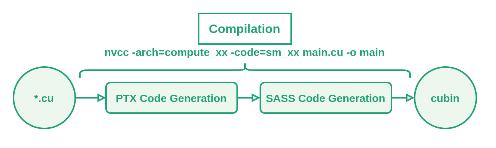



***

*"If you want to benchmark then you should use an actual production grade profiler"* I know, I know. I wanted to check how different things affect the benchmarking of CUDA kernels though. 

The majority of resources online simply tell you to do x or y, but I want to see __*the numbers*__. If you are still reading this, you probably do as well, look at us!

<div class="note">
<p>
I'm afraid this won't be NVIDIA Nsight level. I'm just running some tests ¯\_(ツ)_/¯
</p>
</div>

The code will be C++ but most if not all of the things we will be going over most likely apply to any GPU programming framework.

***

# I genuinely can't be arsed to read all of this what do I need to care about


First of all, you should work on your attention span (I'm kidding, I know we are all very busy). The main takeaways are:

- Use CUDA Events instead of CPU timers.
- Exclude memory transfers unless they are relevant for your specific case.
- Ran warm-up iterations with the same kernel.
- Measure multiple times and look at the statistics.
- Consider flushing the L2 cache between runs.
- Keep power consumption and thermal throttling in check, lock the clocks if needed.
- Minimize interferences by closing applications and services.
- Match your benchmark configuration to your production environment as much as possible.

<!--
Before you open a new tab with a podcast, [here](https://github.com/guillesanbri/cuda-snippets/blob/main/benchmarks/src/benchmark_00_template.cu) you have a template `.cu` file with the boilerplate to benchmark a kernel.
-->

***

# How are we going to do it?

The experiments will start with a very naive and straight-out wrong way to measure the performance of kernels. After that, we will be going over different modifications to the benchmarking code and the overall system, gradually increasing the **accuracy** and **stability** of the timings.

<div class="note">
<p>
<b>Stability</b>: As mentioned in [1], we want <i>stable</i>, and not <i>peak-performance</i> measurements. We will see how different factors affect the repeatability of the measurements, and we will try to mitigate them when possible.
</p>
</div>

I won't go into detail about the statistics we should measure here. We will discuss that [in this other section](#statistics).

The focus of these experiments is on the *relative differences* between benchmarking approaches. Execution times will vary across different GPUs, driver versions, and system configurations, but the patterns between naive and proper measurement techniques should remain consistent. I'm getting ahead of myself, but no matter your setup, asynchronous execution will produce misleadingly low measurements and cache effects will sometimes artificially boost performance when reusing data.

However, for completeness: I'm running these experiments using a desktop RTX 3070 GPU and a AMD Ryzen 7 3800x CPU. The GPU drivers are 565.57.01 and the CUDA version is 12.7.

<!--
<div class="note">
<p>
When reporting benchmarks, it's important to detail the system properly: GPU model/architecture, connections (PCI-E, NVLink), topology if relevant, memory configuration, etc. — If reporting data transfers, then CPU specs become relevant as well.
</p>
<p>
Software-wise, the version of CUDA, used libraries, or drivers, are all valuable to replicate and compare measurements.
</p>
</div>
-->

This post will focus on the execution time of kernels. Nonetheless, it's important to keep in mind that there are several other things that should be taken into account when benchmarking/profiling GPU code:

- Memory bandwidth usage.
- Occupancy.
- Compute utilization.
- Warp-level behaviour.

Maybe in future posts (wink).

***

# The dummy kernel

I will use a very simple matmul kernel for the experiments. The kernel takes matrix A of size `m × k` and matrix B of size `k × n`, and stores the results in matrix C. It doesn't use shared memory tiling or any other optimization, so it will be heavily **memory-bounded**.

> Throughout this post, *matrix size* refers to the case where `m = n = k`

```cpp
__global__ 
void matMulKernel(float *A, float *B, float *C, int m, int k, int n){
    // A * B = C
    // (m x k)(k x n) = (m x n)
    int row = blockDim.y * blockIdx.y + threadIdx.y;
    int col = blockDim.x * blockIdx.x + threadIdx.x;

    if (row < m && col < n){
        float cValue = 0;
        for (int k_i=0; k_i < k; k_i++){
            cValue += A[row * k + k_i] * B[k_i * n + col];
        }
        C[row * n + col] = cValue;
    }
}
```

***

# The Benchmarks

Okay, let's get to it.

## Asynchronous execution

Our first script looks something like this (simplified, full `.cu` file is available [here as benchmark_01_wrong.cu](https://github.com/guillesanbri/cuda-snippets/blob/main/benchmarks/src/benchmark_01_wrong.cu)).

```cpp
...
cudaMemcpy(d_A, h_A, sizeA, cudaMemcpyHostToDevice);
cudaMemcpy(d_B, h_B, sizeB, cudaMemcpyHostToDevice);

// Start measuring time (wrong!)
auto start = chrono::steady_clock::now();
// Launch kernel
matMulKernel<<<gridDim, blockDim>>>(d_A, d_B, d_C, m, k, n);
// Finish measuring time (wrong!)
auto end = chrono::steady_clock::now();
auto duration = chrono::duration_cast<chrono::microseconds>(end - start);
cout << "Kernel took: " << duration.count() << "us" << endl;

cudaMemcpy(h_C, d_C, sizeC, cudaMemcpyDeviceToHost);
...
```

Let's execute this code with a few different matrix sizes and look at the timings.

| Matrix size | Time (us) |
|:-----------:|:---------:|
| 2048        | 238       |
| 4096        | 244       |
| 8192        | 257       |

All of them look suspiciously similar. CUDA kernels are launched asynchronously, which means that when we call a kernel, the CPU simply queues up the work and immediately continues execution. **What we're measuring here is just the time it takes to place the kernel in the execution queue**, not the actual execution time.

To properly measure kernel execution time, **we need to synchronize the CPU with the GPU after the kernel launch**. We can do this by calling `cudaDeviceSynchronize()` before stopping the timer:

```diff
...
// Start measuring time
auto start = chrono::steady_clock::now();
// Launch kernel
matMulKernel<<<gridDim, blockDim>>>(d_A, d_B, d_C, m, k, n);
+ cudaDeviceSynchronize(); // Wait for kernel to finish
// Finish measuring time
auto end = chrono::steady_clock::now();
auto duration = chrono::duration_cast<chrono::microseconds>(end - start);
- cout << "Kernel took: " << duration.count() << "us" << endl;
+ cout << "Kernel took: " << duration.count() / 1000.f << "ms" << endl;
...
```

If we execute the kernel again, we now get *very* different numbers.

| Matrix size | Previous time (us) | New time (ms) | 
|:-----------:|:------------------:|:-------------:|
| 2048        | 238                | 15.518        |
| 4096        | 244                | 121.314       |
| 8192        | 257                | 904.354       |

Notice that we are now measuring **milliseconds**.

> We have excluded the `cudaMemcpy` operations from the timings since memory transfers between pageable memory and device can significantly impact execution time. In most cases you will minimize these transfers by keeping data on the GPU across multiple operations, so we want to focus on the computational performance of the kernel. (*Of course, there might be cases where measuring both makes sense!*)

Once again, the full script is available in [benchmark_02_sync.cu](https://github.com/guillesanbri/cuda-snippets/blob/main/benchmarks/src/benchmark_02_sync.cu).

## CUDA Events

Using `cudaDeviceSynchronize()` is definitely an upgrade, but there is plenty of room for improvement. When we synchronize, we are still including some CPU overhead in the timing — the CPU and the GPU are communicating to confirm that execution has completed. Furthermore, we are also including the overhead from launching the kernel, instead of the pure execution time.

For more precise, GPU-side timing, we can use `CUDA Events`. By default, all operations are queued in the same execution stream, so unless we specify otherwise, we can queue an event, then the kernel, and then another event in the same (default, null) stream. This way, the device will record a time stamp for the events whenever they are executed in the stream.

```diff
...
+ // Create CUDA events
+ cudaEvent_t start, stop;
+ cudaEventCreate(&start);
+ cudaEventCreate(&stop);

// Start measuring time
- auto start = chrono::steady_clock::now();
+ cudaEventRecord(start, 0);

// Launch kernel
matMulKernel<<<gridDim, blockDim>>>(d_A, d_B, d_C, m, k, n);

- // Wait for kernel to finish and measure
- cudaDeviceSynchronize();
- auto end = chrono::steady_clock::now();
- auto duration = chrono::duration_cast<chrono::microseconds>(end - start);

+ // Stop measuring time and compute
+ cudaEventRecord(stop, 0);
+ cudaEventSynchronize(stop);
+ float milliseconds = 0;
+ cudaEventElapsedTime(&milliseconds, start, stop);
- cout << "Kernel took: " << duration.count() / 1000.f << "ms" << endl;
+ cout << "Kernel took: " << milliseconds << "ms" << endl;
...
```

Don't forget!

```diff
+ cudaEventDestroy(start);
+ cudaEventDestroy(stop);
```

We can now compare with the previous approach that used `cudaDeviceSynchronize`:

| Matrix size | CUDA Events (ms) | cudaDeviceSynchronize (ms) | Difference* | 
|:-----------:|:----------------:|:--------------------------:|:------------:
| 512         | 0.293            | 0.407                      | + 38.90%    |
| 1024        | 1.953            | 2.042                      | + 4.56%     |
| 2048        | 15.372           | 15.464                     | + 0.60%     |

\* *These measurements are still quite noisy, so take this column with a grain of salt.*

Notice that we are now measuring the time in smaller matrices. For larger matrices the difference is not that relevant, since the kernel is badly optimized and takes a significant amount of time (tens of milliseconds), making the overhead relatively small. However, for smaller matrices, we can see that the CPU overhead takes a non-trivial amount of time.

Additionally, given that events are CUDA-stream-specific, we can measure overlapping operations in different streams **without forcing a global device synchronization** if we use events instead of `chrono`, which can be very useful for more complex pipelines. 

<!-- (TODO: Add kernel to the repo doing this with async memcpy) -->

The full code is available in [benchmark_03_cudaEvents.cu](https://github.com/guillesanbri/cuda-snippets/blob/main/benchmarks/src/benchmark_03_cudaEvents.cu).

## Cold start

You are probably familiar with the concept of cold start and the fact that it slows down the first execution of your kernel. But, why do we need to warm up the GPU at all?

While not technically cold start, let's take a small detour and start at the compiler level to see why running a benchmark for the first time after compilation is so slow at the moment.

### Detour 1: JIT compilation

When we compile our `.cu` file, the following happens:

<figure align="center">
  
</figure>

***

<figure align="center">
  
</figure>

***

<figure align="center">
  
</figure>


As shown above, the first time we run each kernel after compiling the PTX code, it will be JIT compiled to generate SASS code. This SASS code is then stored in a cache (`~/.nv/ComputeCache` by default) and is fetched in following executions.

> Be mindful about where this cache is getting stored. Distributed or network-based filesystems can become a problem. Likewise, if multiple nodes are accessing the cache at the same time, performance might be affected.

Let's do some quick checks. 

1. If we `export CUDA_FORCE_JIT=1` (default is `0`), JIT compilation will happen every time we launch the kernel. Similarly, we can disable the cache with `export CUDA_CACHE_DISABLE=1`. For our purposes, both approaches will force JIT compilation.

2. If we don't touch these environment variables, JIT compilation will just happen the first time we run the executable. 

If we compare the runtimes of both set-ups, we see quite a difference:

- Kernel when doing (forcing) JIT compilation: **17.436 ms**
- Kernel when fetching the SASS code from cache: **2.010 ms**

To deal with this, you can compile directly for your GPU using the `-arch` and `-code` flags when compiling with `nvcc`. E.g.:

```bash
# -code=compute_86 will generate PTX instead
nvcc -arch=compute_86 -code=sm_86 benchmark_03_cudaEvents.cu -o matmul3
```

Which will look like this (the cubin will still be packed in a fatbin, but without PTX code):

<figure align="center">
  
</figure>

With that out of the way, let's move on to the *actual* cold start that takes place every time we run the kernel. 

Cold start may be affected by several things, including but not limited to (1) driver and context initialization, (2) cache and memory initialization (page mapping and managing, setting up address tables, ...) or (3) GPU clock and power management (idle GPUs might need to increase clock speeds).

Let's change the script and add a few warm-up iterations:

```cpp
...
// Launch the kernel a few times to avoid cold start
for (int i=0; i < CS_ITERS; i++){
    matMulKernel<<<gridDim, blockDim>>>(d_A, d_B, d_C, m, k, n);
}

// Start measuring time
cudaEventRecord(start, 0);
...
```

This code corresponds to [benchmark_04_coldStart.cu](https://github.com/guillesanbri/cuda-snippets/blob/main/benchmarks/src/benchmark_04_coldStart.cu).

| Matrix size | W/o warm-up (ms) | W/ warm-up (ms) |
|:-----------:|:----------------:|:---------------:|
| 512         | 0.363            | 0.233           |
| 1024        | 2.020            | 1.870           |
| 2048        | 15.479           | 15.212          |
| 4096        | 130.988          | 112.442         |

As expected, we can see how all the execution time measurements decrease after introducing the warm-up launches.

Based on what we have seen, warming up with a simpler kernel should alleviate the problem, but not eliminate it entirely, since it fails to properly initialize memory and cache mechanisms with representative access patterns. Let's run a quick experiment using an empty kernel (full code in [benchmark_06_coldStartEmptyKernel.cu](https://github.com/guillesanbri/cuda-snippets/blob/main/benchmarks/src/benchmark_06_coldStartEmptyKernel.cu)):

```cpp
__global__ void warmUp() {}
```

If we include the results in the previous table, we can see that in this case we are somewhere between the cold run and the warmed-up runs, as expected. All in all, it's best to use the actual kernel or a very similar workload when warming-up.

| Matrix size | W/o warm-up (ms) | W/ warm-up (ms) | W/ warm-up and empty kernel (ms) |
|:-----------:|:----------------:|:---------------:|:--------------------------------:|
| 512         | 0.363            | 0.233           | 0.243                            |
| 1024        | 2.020            | 1.870           | 1.897                            |
| 2048        | 15.479           | 15.212          | 15.343                           |
| 4096        | 130.988          | 112.442         | 118.828                          |

## Statistics

Now we have a more refined methodology, but we are still taking only *one* measure of the kernel execution time, which is far from ideal. 

We will keep trying to improve the stability of measurements in the next subsections, but it's still reasonable to alleviate different sources of noise by running the kernels multiple times and looking at statistic metrics instead of single-point data.

Mainly, we want to look at:

- Median execution time.
- Minimum execution time (best-case scenario).
- Standard deviation.
- 95th/99th percentile (common worst-case scenario).
- Coefficient of variation.
- Interquartile range.

> If the measurements follow a normal distribution, reporting _**mean ± std**_ would be enough. It's not uncommon to have significant outliers when benchmarking, so presenting the _**median**_ and an _**appropriate bounding percentile**_ (e.g. $$P_{99}$$) might be a better option.

If we include this in the script, it would look similar to:

```cpp
...
vector<float> runtimes(ITERS);

for (int i=0; i<ITERS; i++){
    // Start measuring time
    cudaEventRecord(start, 0);
    // Launch kernel
    matMulKernel<<<gridDim, blockDim>>>(d_A, d_B, d_C, m, k, n);
    // Stop measuring time
    cudaEventRecord(stop, 0);
    cudaEventSynchronize(stop);
    // Compute time
    float milliseconds = 0;
    cudaEventElapsedTime(&milliseconds, start, stop);
    // Store the measurement
    runtimes[i] = milliseconds;
}

// Print benchmark info
printResults(runtimes);
...
```

As always, [link to the full code here](https://github.com/guillesanbri/cuda-snippets/blob/main/benchmarks/src/benchmark_07_statistics.cu).

## Caches

We are now running the same kernel and input data thousands of times to compute statistics, and we might be taking unwanted help from the cache. Sadly, we don't usually have the same inputs when deploying to production. Let's take a look at how the cache affects our measures.

<div class="note">
<p>
CUDA GPUs have multiple caches. For example, L1 cache is specific to each streaming multiprocessor (SM), and L2 cache is shared across all SMs. We will focus on the L2 cache. L1 caches are much smaller, so we can expect their impact on the benchmarking to be minimal with this kind of data.
</p>
</div>

### Flushing the cache

To flush the L2 cache, it should be enough to allocate a buffer larger than the L2 cache size and initialize it with zeros. This operation forces the GPU to write to every byte in the buffer, effectively evicting any previously cached data from L2. This is pretty much the same approach Lei Mao takes in [7].

```cpp
...
// Get size of L2 cache
int device = 0;
int l2_size = 0;
cudaGetDevice(&device);
cudaDeviceGetAttribute(&l2_size, cudaDevAttrL2CacheSize, device);
size_t sizeF = l2_size * 2;
...
...
for (int i=0; i<ITERS; i++){
  // Inside the benchmarking loop, out of the actual timing
  if (flush){
      cudaMemsetAsync((void *)d_F, 0, sizeF);
      cudaDeviceSynchronize();    
  }
...
```

[The complete script is here](https://github.com/guillesanbri/cuda-snippets/blob/main/benchmarks/src/benchmark_09_cacheFlush.cu), as usual.

The results here are a bit more nuanced. But before explaining that, let's take another detour.

### Detour 2: GPU clocks, power consumption, and temperature

When I first ran the next experiment, the numbers were a bit all over the place. I scratched my head for a while and then looked at the clock rates, which were indeed changing between runs. This shouldn't be surprising since GPUs dynamically adjust their clock rates based on workload, power consumption, and temperature. 

(Hint: Don't watch YouTube randomly if you want repeatable results).

> As a side note with some useful commands, You can check your current GPU clock frequencies using `nvidia-settings -q [gpu:0]/GPUCurrentClockFreqs`. You can lock the clock to a specific frequency with `sudo nvidia-smi -i 0 -lgc 1800,1800` and you can reset it with `sudo nvidia-smi -i 0 -rgc`.

To make the measurements more stable, I fixed my GPU clock to a frequency that ensures no throttling happens (1800 MHz in my case). While I couldn't lock the memory clock (due to my GPU), fixing the GPU clock already stabilized the results significantly.

Now that we have fixed the GPU clock to avoid unwanted noise, let's look at how L2 cache flushing affects kernel execution. We ran the matrix multiplication kernel on matrices ranging from 256×256 to 2048×2048 (in increments of 32 elements per dimension), comparing the execution time with and without cache flushing between runs. The graph below shows the relative increase in execution time when flushing the L2 cache:

$$\text{Rel. execution time increase (%)} = \frac{t_{P50}(\text{flushing}) - t_{P50}(\text{no flushing})}{t_{P50}(\text{no flushing})} * 100$$

<figure align="center">
  
</figure>

We can see various things in the graph. First, flushing the L2 cache consistently increases execution time, with a more noticeable difference in smaller matrices (up to 5% slower for 256×256 matrices). Second, this performance penalty diminishes as matrix size increases, becoming negligible (below 0.5%) for matrices larger than approximately 1024×1024.

Looking at the hardware specifications of the RTX 3070, we can see that it has 4MB of L2 cache. A single 1024×1024 matrix of 32-bit floats takes 4MB of storage (1,048,576 elements × 4 bytes). We are using three matrices (A, B, and C), with a working set significantly larger than the cache capacity. As matrix size grows beyond what the L2 cache can effectively manage, the benefit of cached data between launches diminishes because each kernel execution essentially overwrites the cache with its own access patterns.

It's worth noting that this memory-bound kernel is more sensitive to cache effects than a compute-bound kernel would. A more optimized implementation (using techniques like tiling or shared memory) would probably show different results, most likely with smaller differences in execution time..

<!-- TODO

## Things I won't be taking into account but probably should be checked if performing critical benchmarks (this is way too long for a subtitle) (no I'm not prompting an llm, just a comment)

TODO? Trigger thermal throttling and see how it affects performance. Plot kernel time vs run number. Plot power, clock, temp, power cap. Plot before and after locking the clock to a point where the power doesn't reach the capped limit.

TODO? Comparison using CUDA graphs to study their performance and the API overhead.

TODO? Set up and experiment with non-trivial multi-GPU systems and distributed compute in general.

TODO? 1vs1 comparison with nsight metrics. Try to get as close as possible.

TODO? Add final template? A CLI script with some utilities to benchmark a given kernel.

***
-->

***

# Conclusion

Thank you for reading the whole thing! (Or for scrolling to the end!) We went from a naive "just measure the function call time" approach to a more robust benchmark that accounts for asynchronous execution, warm-up runs, cache effects, and statistical analysis. Along the way, we've seen how each factor can impact your measurements, particularly for shorter-running kernels where overheads and system effects are proportionally larger.

Of course, remember that your benchmarking code should always be designed with the end application in mind to make it as relevant as possible. Try to make it as close to the real world as possible!

***

# Related and cool links

- [1] [GTC2019 - Best Practices When Benchmarking CUDA Applications](https://developer.nvidia.com/gtc/2019/video/s9956) and [its slides](https://developer.download.nvidia.com/video/gputechconf/gtc/2019/presentation/s9956-best-practices-when-benchmarking-cuda-applications_V2.pdf)
- [2] [NVIDIA Docs - Profiling Guide](https://docs.nvidia.com/nsight-compute/ProfilingGuide/index.html)
- [3] [This article from Simon Boehm and all its references](https://siboehm.com/articles/22/CUDA-MMM)
- [4] [GPU MODE - Lecture 1](https://www.youtube.com/watch?v=LuhJEEJQgUM)
- [5] [Kaixi Hou's Log - nvcc options ](https://kaixih.github.io/nvcc-options/)
- [6] [NVBench repo](https://github.com/NVIDIA/nvbench)
- [7] [Lei Mao - Hot vs cold Cache Performance](https://leimao.github.io/blog/CUDA-Performance-Hot-Cold-Measurement/)
- [8] [This SO answer from Robert Crovella](https://stackoverflow.com/questions/64701751/can-i-fix-my-gpu-clock-rate-to-ensure-consistent-profiling-results/64729952#64729952) and the linked [NVIDIA blog post on stable power states](https://developer.nvidia.com/blog/advanced-api-performance-setstablepowerstate/)

***