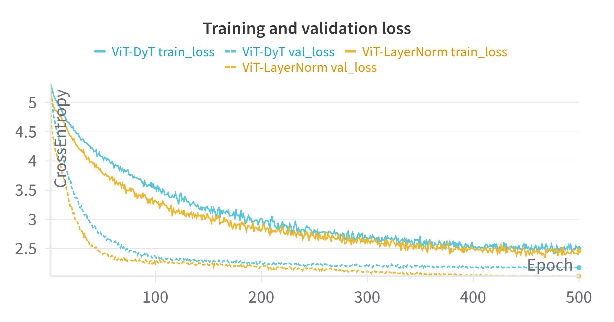
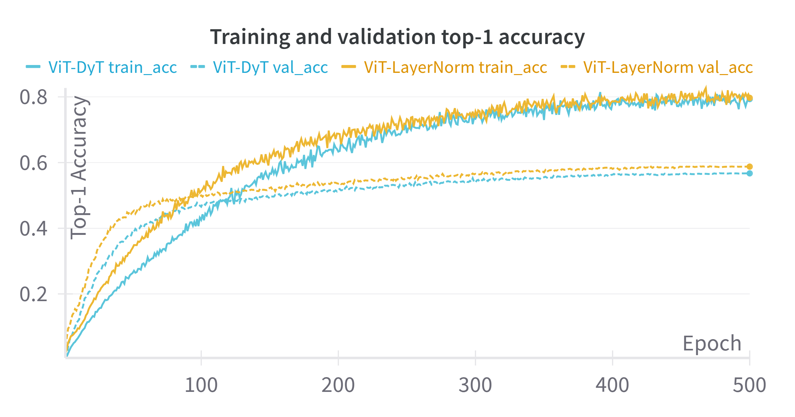



***

A few weeks ago, Meta published [Transformers without Normalization](https://arxiv.org/abs/2503.10622) and introduced **Dynamic Tanh (DyT)**, a surprisingly simple replacement for normalization layers (usually **LayerNorm** and **RMSNorm** in transformers). 

I recommend giving the paper a read, but in summary: turns out that normalization layers' input-output mapping closely resembles tanh functions. Based on this observation, they replace normalization layers with a linear transformation of a tanh (learnable $$\gamma$$ and $$\beta$$) and a new learnable parameter $$\alpha$$ that scales the inputs. This results in:

$$\text{DyT}(x) = \gamma * \text{tanh}(\alpha x) + \beta$$

Given how established and important normalization layers have always been, I found this very impressive and wanted to try it out. Sadly, all my H200 are busy at the moment of writing (I don't have any), so I decided to run a few experiments training smaller models.

***

# The experiment

I trained two smaller Vision-Transformer-like models from scratch: one using **LayerNorm** and the other using **DyT**. In both cases, the normalization layers were placed in the pre-norm within the transformer blocks (both MHA and FFN) and right before the final linear projection. 

> The code of the ViTs follows [timm](https://github.com/huggingface/pytorch-image-models/blob/main/timm/models/vision_transformer.py#L425) and [lucidrain](https://github.com/lucidrains/vit-pytorch/blob/main/vit_pytorch/vit.py) implementations as reference and [is available here](https://github.com/guillesanbri/zoo/blob/main/models/vit.py).

The code for DyT is quite straightforward:

```python
import torch
import torch.nn as nn

class DyT(nn.Module):
    def __init__(self, C, init_alpha=0.5):
        super().__init__()
        self.alpha = nn.Parameter(torch.ones(1) * init_alpha)
        self.beta = nn.Parameter(torch.ones(C))
        self.gamma = nn.Parameter(torch.ones(C))

    def forward(self, x):
        x = torch.tanh(self.alpha * x)
        return self.gamma * x + self.beta
```

The goal was simple, comparing the training dynamics and the final performance.

Both models were trained on [tiny-imagenet-200](http://cs231n.stanford.edu/tiny-imagenet-200.zip), a subset of ImageNet with 200 classes, 100k train images, and 10k validation images.

> For some reason that escapes me, the validation and the train directories in tiny-imagenet have different structures, so you will have to (1) reorganize the validation files if you want to use PyTorch's `ImageFolder` or (2) write a custom dataset class for them.

The ViT models are configured to be relatively small to be trained on less powerful hardware. They have 4 heads, 6 encoder blocks, and an embedding dimension of 768. Images were scaled to 128x128 with a patch size of 16x16. Arguably, the patches are a bit too big for this image size. A 8x8 patch would probably have been a better choice to capture more detail, but my GPU asked for mercy with a not-so-subtle OOM error.

The [training script is also available in GitHub](https://github.com/guillesanbri/zoo/blob/main/train_imagenet.py), but here is a quick summary:
- Number of epochs: 500
- Batch size: 256
- Optimizer: AdamW
- Learning rate: 3e-4 (with a cosine decay schedule and 10-epoch warmup)
- Regularization: Quite intense data augmentation (RandomResizedCrop, RandomHorizontalFlip, RandAugment, RandomErasing, Mixup) and a 10% dropout in both the attention layers and the MLPs.
- Trained in mixed precision.

For the experiments I used an NVIDIA RTX3070 with 8GB of VRAM.

The paper mentions that DyT can be used as a drop-in replacement without significant hyperparameter tuning. I specifically tuned the hyperparameters only for the LayerNorm version of the model and then used those exact same hyperparameters for the DyT version.

***

# Training results

Let's take a look at the loss curves:

<figure align="center">
  
</figure>

At first glance, there is something that seems a bit counter-intuitive: the training loss (solid lines) is consistently *higher* than the validation loss (dashed lines). This isn't really a mistake, but rather an expected outcome when using aggressive regularization like we did. During training, the model is evaluated on heavily transformed and blended images, which are inherently much harder to classify correctly than the relatively "clean" examples in the validation set.

Now, let's take a look at the top-1 accuracy curves:

<figure align="center">
  
</figure>

This graph shows a different pattern. We can see how training accuracy keeps growing throughout training, while the validation accuracy seems to plateau with a more defined "elbow" around epoch 100 (though it slowly keeps improving later on).

> There is a very valid question to ask here. **If the train loss was consistently higher than the validation loss, how can training accuracy be better than validation accuracy?** 

What I believe is happening here is that while the model is indeed getting more and more predictions correct over time, cross-entropy is penalizing the difference in the softened labels (due to mixup/cutmix augmentation). The actual prediction might be correct, but the loss function is looking at the difference between the output probability distribution and the augmented ground truth labels. As an example, if cutmix merges a picture of a cat and one with a dog, the model might get the classification right, but not output the expected blend of classes (65% cat, 35% dog) correctly. **The model is getting better at picking the right class, but doesn't correctly represent the full blended target distribution**.

Putting that aside, we can now look at the actual comparison we were interested in, how did the DyT model perform relative to the standard LayerNorm?

| Model configuration      | Val. Loss (Epoch 500) | Val. Accuracy (Epoch 500) |
|:------------------------:|:---------------------:|:-------------------------:|
| w/ LayerNorm             | 2.0262                | 0.5876                    |
| w/ DyT                   | 2.1730                | 0.5671                    |

In the models we have trained, we can see how the model using DyT performed **very similarly** to the standard LayerNorm model. Both models show nearly identical training and validation curves, effectively plateauing in validation performance around the same point.

While this demonstrates that DyT is a successful drop-in replacement (which is very impressive!), it did not provide a notable performance boost over LayerNorm in this particular small-scale experiment. This contrasts slightly with the paper's results, which showed DyT matching or even exceeding performance in most settings.

As the paper itself highlights, results can vary depending on the model size, dataset, and specific hyperparameters. It's also worth remembering the paper's observation that proper tanh-like behaviour appears more strongly in deeper network blocks, while shallower layers look more linear. Given that our ViT models are relatively shallow with only 6 encoder blocks, this could potentially be one reason why DyT didn't show a distinct advantage compared to LayerNorm.

***

# Time analysis

When training our models, the DyT variant took a bit longer to complete 500 epochs compared to the LayerNorm version (14.8h vs 13.5h), roughly a ~10% difference. I was expecting the tanh version to be slightly *faster*, so I decided to dig a bit more. There are a couple of things to take into account when looking at the paper efficiency results.

- They actually measure training/inference time in Llama2, which means comparing against RMSNorm instead of LayerNorm.
- Both the sequence length and the embeddings are significantly larger in the case of the Llama2 results they present (seq_length=4096, hidden_size=4096) compared to our ViTs (seq_length=65, hidden_size=768). 

Let's take a look at some inference micro-benchmarks on the isolated modules (averaged over 100k runs):

| Seq. Length, Hidden size      | RMSNorm (ms) | LayerNorm (ms) | DyT (ms)  |
|:-----------------------------:|:------------:|:--------------:|:---------:|
| (65, 768)                     | 0.112        | **0.053**      | 0.075     |
| (4096, 4096)                  | 1.936        | 0.805          | **0.535** |

The table pieces the differences together. For smaller dimensions like in our ViT, LayerNorm is still faster than DyT. However, as these dimensions grow to Llama-like sizes, DyT becomes faster and eventually surpasses LayerNorm. Interestingly, in both cases RMSNorm is still slower than the two other layers (which is consistent with the paper). 

These results raise yet another question: **How can RMSNorm be slower than LayerNorm?** 

RMSNorm is theoretically simpler than LayerNorm (it avoids calculating the mean) so it should be faster. My guess here is that LayerNorm benefits from more optimized and more mature kernels which are better tuned, use fused operators that RMSNorm does not, etc.

***
<!--
# Extra: Visualizing the layer norm mappings? (TODO?)

***
-->
# Conclusions

The experiments showed that models using DyT can be trained comparably to those with standard LayerNorm, which is already a success! On the other hand, the accuracy in these small scale setups took a dent when replacing these layers. The way I see it, whether or not to use these modules is something to try and test based on the model depth and scale, instead of blindly assuming that they are a better option.

When it comes to efficiency, while DyT is a very promising alternative and demonstrates speedups at large scales, using a basic implementation for smaller sequences and embedding dimensions might currently hinder performance slightly compared to using LayerNorm. That being said, it's reasonable to expect that if DyT gets wider community adoption, optimized kernels will emerge, making it competitive or faster across a wider range of scales.

***

Thanks for reading!

***

# Related links

- [Transformers without Normalization](https://arxiv.org/abs/2503.10622)
- [PyTorch LayerNorm docs](https://pytorch.org/docs/stable/generated/torch.nn.LayerNorm.html)
- [ViT implementation used in the experiments](https://github.com/guillesanbri/zoo/blob/main/models/vit.py)
- [How to train your ViT?](https://arxiv.org/abs/2106.10270)
- [ViT implementation in timm](https://github.com/huggingface/pytorch-image-models/blob/main/timm/models/vision_transformer.py#L425)
- [ViT implementation by lucidrains](https://github.com/lucidrains/vit-pytorch/blob/main/vit_pytorch/vit.py)

***