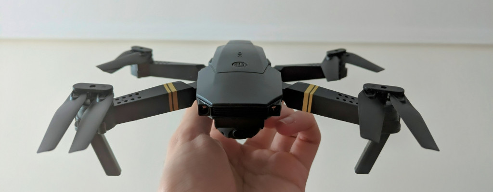
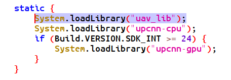
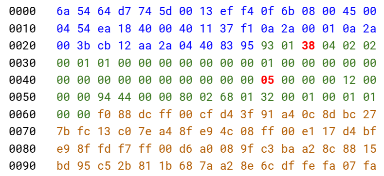
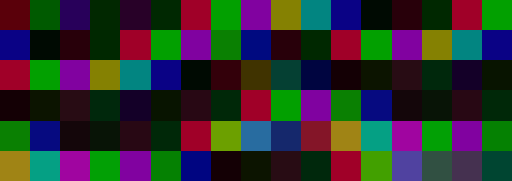

***

Cheap drones often stream video and communicate over WiFi. The protocol is rarely documented, but we can reverse engineer it! This post covers how I went from raw packets flying through the air to live drone footage showing up in OpenCV.

<iframe src="https://giphy.com/embed/xAzyGWCkWXF4kLFX7g" width="100%" height="100%" style="position:absolute;border-radius: 0.25rem;" frameBorder="0" class="giphy-embed" allowFullScreen></iframe>

I've wanted to build a drone to run some SLAM/DL algos for a while. A few days ago I saw [Marshall Richards reversing the video and control commands of a toy drone](https://x.com/marshallrichrds/status/1922508365713846678), which was very inspiring. I figured it would be a good learning exercise and a quick way to test models for the time being. Props to him!

The code is available in the [E58-drone-reversing repo](https://github.com/guillesanbri/e58-drone-reversing).

***

# The drone

The test subject was an E58 drone. It includes a remote controller and an app (WiFi UAV) for live video streaming. I can't really tell if it's the original one from Eachine or a knock-off of a knock-off. Regardless, it's a *very* cheap drone from Amazon (~50€).

Several blogposts and repos go over the control commands for this drone (see [Related links](#related-links)). However, to the best of my knowledge, nothing has been published on how to get the full-framerate video feed. Now there is!

<figure align="center">
  
  <figcaption>Our little fella</figcaption>
</figure>

***

# The WiFi UAV app

The app was obviously the first thing to look at. I went through the following:

- First, I decompiled the app with JADX hoping to find the networking and the video decoding logic. Instead, I found the interesting parts compiled into various `.so` files.

<figure align="center">
  
  <figcaption>Bummer :(</figcaption>
</figure>

- I exported the `.so` files and tried my luck with `objdump`. There were some objects called `jpeg_header_640x360_Q100` and similar. Useful info but nothing crazy.
- Lastly, I downloaded Ghidra and tried to look inside the `.so` file. Couldn't figure out much with it.

Other than the image size info, I wasn't getting a lot out of the `.so` file, so I decided to try something different.

***

# Wireshark

The new strategy was to capture the traffic between the drone and the mobile app. To my surprise, most Android apps promising to trace packets are either lying or require root. 

Eventually, I found a couple that worked by creating a local VPN on the phone. Sadly, this interfered with the drone connection, causing the video stream to stop immediately.

> I considered setting up an emulator on my PC, but I suspected that if the app had issues with the VPN, running it within an emulator wasn't the most promising approach.

I decided to take a simpler approach and created an Access Point (AP) in my computer, connecting the phone to it while simultaneously using Wireshark to trace the network traffic between them.

> This solution is suboptimal and required a few extra steps (more on that later) because the computer wasn't yet sending any responses back. Nonetheless, it got me the first significant piece of information.

When opening the app, it repeatedly sent two **UDP packets** to port `8800` of the AP, each with the payload `0xEF 0x00 0x04 0x00`.

***

# Understanding and reconstructing the video feed

At that point I had a message to send to the drone. I did so, and the drone got back with multiple, large packets! Back to the research table (a markdown file filled with hex dumps), I looked at the payloads and identified some important details:

- The first 56 bytes are a custom header. The actual payload comes after this.
- Byte 32 of the header identifies the fragment within the frame (incrementally, i.e. 1, 2, 3...).
- Byte 3 of the header changes depending on whether the packet is the last fragment of a frame or not (usually `0x38`).

<figure align="center">
  
  <figcaption>Start of the JPEG packet. Blue is UDP header. Green is drone header (with bytes 3 and 32 highlighted in red). Brown is image data.</figcaption>
</figure>

After removing the headers and concatenating the payloads from all the messages, I had a data blob that I presumed to be image data. There were some straightforward things to check:

- Are there any JPEG markers (SOI, SOF)? Not really.
- Is the PNG magic number present? Nope.
- Do we have H.265/H.265 NAL identifiers? Negative.
- Is this just raw color data?

<figure align="center">
  
  <figcaption>Hint: It wasn't raw color data</figcaption>
</figure>

The size of the concatenated payloads (~15kB) basically confirms that the data is compressed. Given the JPEG hints from `objdump`, it didn't seem crazy that the drone was omiting the headers to reduce data transmission, and that it was possible to construct a valid image by adding the corresponding headers to the blob.

## MJPEG and JPEG headers

Let’s take a detour into MJPEG. Unlike modern codecs like H.264 or H.265, which use inter-frame compression (encoding differences between frames), MJPEG treats each frame as an independent JPEG image. That makes it simpler to reverse, as we only need to decode one image at a time.

JPEGs are composed of segments marked by specific byte sequences called markers. Internally, the image data is typically encoded in YCbCr color space, which separates brightness (luma) from color (chroma) for better compression.

To construct a decodeable JPEG, we just needed to prepend the right headers and markers. A minimal set of JPEG components includes:

- SOI (Start Of Image) marker: `0xFF 0xD8`
- Frame and scan headers: `SOF` and `SOS`
- Quantization tables: `DQT`
- Huffman tables (which we can skip! OpenCV fills in defaults if they're missing).
- EOI (End Of Image) marker `0xFF 0xD9`

---

By putting together the fragments, adding the necessary JPEG structure, and letting OpenCV handle the rest, we finally got our first decoded frame, it worked!

<figure align="center">
  
</figure>

Okay we now have video! Right? Sadly, not quite. Repeatedly sending `0xEF 0x00 0x04 0x00` results in a harsh reality: the frame rate is approximately 2FPS. The app has a much higher frame rate, so I was clearly missing something. Time to go back to Wireshark.

To simulate the drone behaviour as closely as possible, I captured multiple frames of JPEG data from the slow stream. With the phone connected to the computer's AP, a python script waited for the app to make requests and responded with the JPEG payloads that were previously collected. Once it started receiving frames, the app stopped sending the `0xEF 0x00 0x04 0x00` command and switched to sending much longer packages.

> My guess is that `0xEF 0x00 0x04 0x00` is the "start video" request, which most likely involves some initialization that slows down the stream. These new packets, on the other hand, are likely to be "send new frame" requests.

After looking for differences between them I figured out that bytes **(12, 13)** in the first message (little endian), and **(12, 13), (88, 89) and (107, 108)** in the second message identify the frame being requested. We can easily keep track of the number of frames we have requested, and use this information to update the payload before sending it to the drone.

Furthermore, now that we are asking to "send new frames", we can see that bytes **(16, 17)** in the fragment's header incremented with each frame. Presumably, this is a "frame number identifier", which, as expected, was always zero when we were only using the "start video" command.

***

# Result

In conclusion, initializing the video stream first and then sending these "next frame" payloads with an incrementing frame index did the trick! We now get consecutive frames from the drone at a much more respectable framerate of around 20 FPS.

I spoiled it at the beginning, but here is a video of the drone sending the live feed of its camera to the computer, along with some simple feature detection.

<iframe src="https://giphy.com/embed/xAzyGWCkWXF4kLFX7g" width="100%" height="100%" style="position:absolute;border-radius: 0.25rem;" frameBorder="0" class="giphy-embed" allowFullScreen></iframe>

***

Overall, super fun project, I had never done any reversing before so very cool to give it a go. Thanks for reading!

***

# Related links

- [Turbodrone repo](https://github.com/marshallrichards/turbodrone)
- [Hacking Chinese Drones for Fun and (No) Profit](https://blog.horner.tj/hacking-chinese-drones-for-fun-and-no-profit/)
- [Reverse Engineering Chinese WIFI UAV Drone](https://github.com/FahrulID/reversing-wifi-uav)
- [HTB - Reverse engineering a drone's IP cam stream](https://forum.hackthebox.com/t/reverse-engineering-a-drones-ip-cam-stream/3800/18)
- [Eachine E59 Custom Firmware](https://github.com/flaminggoat/Eachine-E58-CFW)

***