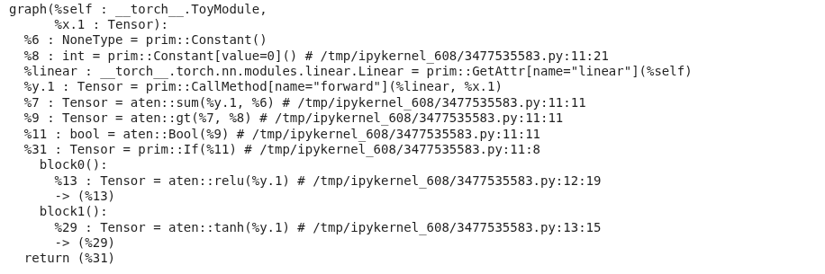
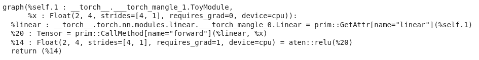

---

PyTorch has accumulated a lot of compiler-related terminology over the years. The goal of this post is to make sense of the ecosystem, moving from the legacy intermediate representations and capture mechanisms to the modern compilation stack.

This post focuses on using compilation to **speed up PyTorch execution**. This means training and inference **within** Python, though I'll briefly go over deployment-oriented paths to place them on the map.

---

# PyTorch as a Framework

By default, PyTorch operates on **eager-mode**: it executes its operations immediately as the interpreter goes through the script. Compared to deep learning frameworks that use [static computational graphs](https://www.tensorflow.org/guide/intro_to_graphs), PyTorch doesn't build a graph before or during execution (it actually does, but not for performance reasons, see below). Eager mode allows us to step through the code with a debugger, access intermediate values (e.g. for printing), or use arbitrary Python code as part of the program. This is what got PyTorch to where it is right now, but it comes with a cost: Since operations are dispatched individually, they can't be fused or optimized. Every call comes with Python, dispatcher, kernel-launch, and device-specific overhead.

> I lied when I said PyTorch doesn't build a graph during execution. It builds an **autograd graph** (a dynamic computational graph), which is conceptually similar in the sense that it is a symbolic graph of the operations and the relationship between them, but it's only used for backpropagation and not for any kind of optimization / forward pass / deployment.

To remediate this, PyTorch allows the user to build graphs that represent the forward and backward passes for a compiler to analyze and optimize. Due to the complexity of capturing dynamic control flow and semi-arbitrary Python code, there have been multiple attempts to do this and not gonna lie, it got a bit confusing.

---

# Key concepts

Before getting into the specifics, let's review some terms:

## Graphs and Intermediate Representations

When we talk about graphs in the context of DL execution/compilation, we refer to a DAG ([Directed Acyclic Graph](https://en.wikipedia.org/wiki/Directed_acyclic_graph)). Basically, this is a data structure where nodes are operations and the edges represent the data flowing between them (inputs/outputs).

Graphs are expressed in an IR (Intermediate Representation), which is a language that sits between the source code (e.g. Python) and the target code (e.g. CPU instructions, CUDA PTX). The goal of an IR is to give the compiler a clear, well-defined set of operations that can be optimized and translated to a specific backend.

> In a typical compilation pipeline, multiple IRs exist at different abstraction levels. We will focus on high-level framework IRs and leave aside compiler-specific IRs (e.g. those used within TorchInductor or LLVM).

## Just-In-Time and Ahead-Of-Time compilation

JIT (Just-In-Time) compilation happens during execution. The first time the function runs it gets compiled, with the optimized representation being cached for subsequent executions. The system may recompile if inputs change (shapes, dtypes, ...). 

AOT (Ahead-Of-Time) compilation happens before execution. The model or function is transformed into an optimized artifact that is used afterwards.

## Capture strategies

An important challenge of compiling is graph capture, which means turning a Python function into a graph. There are multiple fundamentally different approaches:

- **Scripting**: Parsing the source code (usually the AST, Abstract Syntax Tree). It can capture control flow statements (`if`, `for`, ...) but it's usually restricted to a subset of Python and requires strict type annotations (spoiler: this is `torch.jit.script`).

- **(Conventional) Tracing**: Runs the model with actual inputs and records the operations being executed. This removes all control flow, baking the path that ran with that specific input (spoiler: this is `torch.jit.trace`).

- **Symbolic Tracing**: Similar to conventional tracing, but using proxy objects instead of real tensors. It can deal with static control flow but doesn't track data-dependent control flow correctly since it uses proxy objects with no real values (spoiler: this is `torch.fx.symbolic_trace`).

- **Bytecode capture**: Hooks into the CPython's (the standard Python interpreter) frame evaluation and intercepts Python [bytecode](https://opensource.com/article/18/4/introduction-python-bytecode), analyzing it before it gets executed. This enables capturing tensor operations into a graph (last spoiler: this is `torch.compile`).

> We will talk about unsupported code (data-dependent control flow, C extensions, ...) in bytecode capture and how `torch.compile` / `TorchDynamo` use graph breaks to deal with them.

---

# TorchScript

TorchScript was the first compilation system in PyTorch, its goal was to capture a model as a graph, optimize it, and deploy it without Python. There were two ways to capture the graph:

- `torch.jit.script`: It parsed the function's source code (AST) and compiled it to TorchScript IR. It could register control flow but as mentioned earlier, required strict type annotations and no arbitrary classes / data structures. Essentially, it meant either writing the code with scripting in mind or rewriting significant portions of it.
- `torch.jit.trace`: The "conventional" tracing approach. The function was called with specific inputs and the executed operations were recorded into the graph. Fundamentally limited when it comes to control flow.

> You could actually combine them, but the process was brittle, labor-intensive, and far from optimal.

The output of both paths was a graph containing TorchScript IR, which could be serialized and loaded in a different environment (e.g.: `LibTorch`, the C++ runtime).

> Both TorchScript and these functions are deprecated since [PyTorch 2.10](https://pytorch.org/blog/pytorch-2-10-release-blog/).

Let's capture a toy module in a few different ways and inspect the resulting graphs to get a better intuition of how each IR looks.

```python
import torch
import torch.nn as nn

class ToyModule(nn.Module):
    def __init__(self):
        super().__init__()
        self.linear = nn.Linear(4, 4)

    def forward(self, x):
        y = self.linear(x)
        if y.sum() > 0:
            return y.relu()
        return y.tanh()

model = ToyModule()
x = torch.randn(2, 4)
```

We'll use a data-dependent branch to highlight some differences.

`torch.jit.script` parses the source and preserves the `if`, while `torch.jit.trace` bakes in whichever branch ran for the example input.

```python
scripted = torch.jit.script(model)
print(scripted.graph)
```

<figure align="center">
  
</figure>


```python
traced = torch.jit.trace(model, x)
print(traced.graph)
```

<figure align="center">
  
</figure>

The scripted graph keeps the conditional as a `prim::If` node with both branches as subgraphs, in contrast, the traced graph contains **only** the operators executed for `x` (e.g. just the `aten::relu` path).

> Operators in TorchScript IR live in two namespaces, `aten::*` and `prim::*`
> - **ATen**[sor library] is PyTorch's core tensor library, these are the actual tensor kernels (`aten::linear`, `aten::relu`, `aten::tanh`, `aten::sum`, ...).
> - **Prim**[itive Ops] are a lower-level set of primitives that cover both tensor ops (e.g. `prim::add`) and control flow and structural building blocks (`prim::If`, `prim::Loop`, `prim::Constant`, `prim::ListConstruct`, `prim::GetAttr`, `prim::CallMethod`, ...).
>
> TorchScript uses ATen for the compute nodes and Prim for the control flow and the graph structure.

---

# torch.fx

FX followed TorchScript in the search for a better graph representation. FX is actually a toolkit with the main goal of facilitating Python-to-Python transformation passes on the graph for optimization. 

It includes its own IR format (a graph) and also a symbolic tracer (`torch.fx.symbolic_trace`). As mentioned in the "Capture Strategies" subsection, symbolic tracing is unable to capture data-dependent control flow or calls into C extensions. 

`torch.fx.symbolic_trace` runs the forward with proxy objects and records every op call into a `GraphModule`. It can't see real tensor values, so the data-dependent `y.sum() > 0` check in our toy model raises during tracing:

```python
import torch.fx as fx
# TraceError: symbolically traced variables cannot be used as inputs to control flow
fx.symbolic_trace(model)             
```

Removing the branch (or replacing it with a static one) lets FX produce a graph:

```python
class ToyLinear(nn.Module):
    def __init__(self):
        super().__init__()
        self.linear = nn.Linear(4, 4)

    def forward(self, x):
        return self.linear(x).relu()

gm = fx.symbolic_trace(ToyLinear())
gm.graph.print_tabular()
```

```
opcode       name    target    args       kwargs
-----------  ------  --------  ---------  --------
placeholder  x       x         ()         {}
call_module  linear  linear    (x,)       {}
call_method  relu    relu      (linear,)  {}
output       output  output    (relu,)    {}
```

> Eventhough [the docs](https://docs.pytorch.org/docs/2.11/fx.html) consider the FX graph an IR, I find it easier to understand it as a container that is used with multiple IRs. We will see this in more detail below, but for now, understand that the ops stored in FX graph nodes can belong to different IRs.

An FX node has one of six **opcodes** (`placeholder`, `get_attr`, `call_function`, `call_method`, `call_module`, `output`) and its **target** is whatever **Python-level** callable is being invoked. 

`symbolic_trace` records calls at the Python API level, so we will see `nn.Linear` as a `call_module` and `.relu()` as a `call_method`. Unlike in TorchScript, none of those belong to the ATen / Prim namespaces. 

As we will see now, `torch.compile` and TorchDynamo supersed symbolic tracing. Nonetheless, the FX graph IR/container survived and remains the core representation format.

---

# torch.compile

`torch.compile` is **the current recommended path for speeding up PyTorch models**, both for training and inference. Wrapping a function or model with `torch.compile` triggers a JIT compilation, the first run will capture and compile the computation (important to warm up if you are benchmarking!).

> It's important to keep in mind that `torch.compile` doesn't guarantee bitwise equivalence with eager code, which can affect convergence in brittle training regimes.

To understand how `torch.compile` works, let's look at its main components:

## TorchDynamo

This is the capture engine. It uses bytecode capture in the CPython frames to intercept all the code during execution. Let's ignore problematic code and graph breaks for now. Dynamo captures the frame (with all the execution context of the function) and uses [Fake tensors](https://docs.pytorch.org/docs/2.11/user_guide/torch_compiler/torch.compiler_fake_tensor.html) to symbolically interpret the CPython bytecode without executing it. Once the frame has been evaluated and the graph has been captured, the latter goes to the specified backend.

> Since TorchDynamo operates at the Python bytecode level, the FX graph it produces will have Python-level functions, similarly to `symbolic_trace` (but through a completely different mechanism!)

## AOTAutograd

Okay I lied again, we won't go into backends just yet. Before that, let's take a look at `AOTAutograd`, which is a middleware in the compiler stack often used by the backends (for example, Inductor, PyTorch's default backend). The goal of AOTAutograd is two-fold:

- Creates a joint graph for the forward and backward pass, which enables cross-boundary operation fusion or informed activation memory planning.
- Converts the Python-level operations captured by Dynamo into functional ATen operators.

> AOT here means that the compilation happens before the kernel gets executed, which conflicts a bit with the idea of "compiling before the program runs".

## Backends

The backend is in charge of generating executable code from the FX graph. 

> The backend can be specified when calling the `torch.compile` function and it's how third-party compilers (e.g. TensorRT, OpenVINO) integrate with the `torch.compile` ecosystem.

The default PyTorch backend is **Inductor**. Inductor takes the FX graph (previously lowered by AOTAutograd), lowers it to its own IR, and generates either custom **Triton** kernels for GPU or **C++/OpenMP** code for CPU based on that representation. 

`torch.compile` also supports modes that control how Inductor behaves. The default mode balances compile time and performance. `reduce-overhead` uses CUDA graphs to minimize Python and kernel launch overhead, which is particularly useful for smaller inputs whose latency is dominated by kernel launches. However, this comes with higher memory usage, requires static input shapes, and doesn't support certain operations that require CPU-GPU synchronization. `max-autotune` benchmarks multiple kernel variants at compile time (tiling sizes, warp counts, fusion strategies) and selects the fastest for your specific hardware, trading longer compilation for better runtime performance.

> The `eager` and `aot_eager` backends can be used for debugging. They skip code generation and run the captured graph in eager mode. `eager` only tests Dynamo's capture, while `aot_eager` also runs through AOTAutograd. By narrowing down at which stage a failure occurs, you can tell whether the issue is in graph capture, autograd tracing, or code generation.

We can also create our own backend for inspection puposes, let's start with the TorchDynamo output:

```python
def print_backend(gm: torch.fx.GraphModule, example_inputs):
    gm.graph.print_tabular()
    return gm.forward

compiled = torch.compile(ToyLinear(), backend=print_backend)
compiled(x)
```

```
opcode         name                                      target                                    args                                                                                      kwargs
-------------  ----------------------------------------  ----------------------------------------  ----------------------------------------------------------------------------------------  --------
placeholder    l_self_modules_linear_parameters_weight_  L_self_modules_linear_parameters_weight_  ()                                                                                        {}
placeholder    l_self_modules_linear_parameters_bias_    L_self_modules_linear_parameters_bias_    ()                                                                                        {}
placeholder    l_x_                                      L_x_                                      ()                                                                                        {}
call_function  linear                                    <built-in function linear>                (l_x_, l_self_modules_linear_parameters_weight_, l_self_modules_linear_parameters_bias_)  {}
call_method    relu                                      relu                                      (linear,)                                                                                 {}
output         output                                    output                                    ((relu,),)                                                                                {}
```

As mentioned earlier, the output of TorchDynamo is an `fx.GraphModule` too, but produced through bytecode capture instead of symbolic tracing. It has the same overall structure compared to the `symbolic_trace` one, but the Dynamo graph is a bit more explicit. The `nn.Linear` submodule has been inlined into a `call_function` to `torch.nn.functional.linear`, with its `weight` and `bias` lifted out as separate `placeholder` inputs instead of hidden inside a `call_module`. Dynamo flattens module boundaries and exposes parameters as graph inputs, which gives the backend a flatter, more uniform graph to optimize. 

We can now include `AOTAutograd` as part of our dummy backend, """similarly""" to how Inductor does it:

```python
from torch._dynamo.backends.common import aot_autograd

def fw(gm, example_inputs):
    print("Forward pass: ")
    gm.graph.print_tabular()
    return gm.forward

def bw(gm, example_inputs):
    print("Backward pass")
    gm.graph.print_tabular()
    return gm.forward

backend = aot_autograd(fw_compiler=fw, bw_compiler=bw)

compiled = torch.compile(ToyLinear(), backend=backend)
out = compiled(x).sum()
out.backward()
```

```
Forward pass:
opcode         name       target               args                          kwargs
-------------  ---------  -------------------  ----------------------------  --------
placeholder    primals_1  primals_1            ()                            {}
placeholder    primals_2  primals_2            ()                            {}
placeholder    primals_3  primals_3            ()                            {}
call_function  t          aten.t.default       (primals_1,)                  {}
call_function  addmm      aten.addmm.default   (primals_2, primals_3, t)     {}
call_function  relu       aten.relu.default    (addmm,)                      {}
call_function  detach     aten.detach.default  (relu,)                       {}
output         output     output               ((relu, primals_3, detach),)  {}


Backward pass:
opcode         name                target                           args                             kwargs
-------------  ------------------  -------------------------------  -------------------------------  --------
placeholder    primals_3           primals_3                        ()                               {}
placeholder    detach              detach                           ()                               {}
placeholder    tangents_1          tangents_1                       ()                               {}
call_function  detach_1            aten.detach.default              (detach,)                        {}
call_function  threshold_backward  aten.threshold_backward.default  (tangents_1, detach_1, 0)        {}
call_function  t_1                 aten.t.default                   (threshold_backward,)            {}
call_function  mm                  aten.mm.default                  (t_1, primals_3)                 {}
call_function  t_2                 aten.t.default                   (mm,)                            {}
call_function  sum_1               aten.sum.dim_IntList             (threshold_backward, [0], True)  {}
call_function  view                aten.view.default                (sum_1, [4])                     {}
call_function  t_3                 aten.t.default                   (t_2,)                           {}
output         output              output                           ((t_3, view, None),)             {}
```

In this case we can see both the forward and the backward pass as graphs, which we were not getting before since we were not using AOTAutograd. Likewise, we can notice that the ops within the FX graph nodes are now **ATen** ops, and not Python-level callables.

## Back to TorchDynamo now that we have context

One of the main advantages of using TorchDynamo instead of `torch.jit.trace` or `fx.symbolic_trace` is the fact that it can deal with unsupported code by using **Graph breaks** and that it keeps track of **Guards**.

### Graph Breaks

When Dynamo encounters problematic code (data-dependent control flow, unsupported structures, C extensions, ...) it creates a graph break. This essentially means that it compiles the graph that has been recorded so far (going through the whole process we saw, e.g. AOTAutograd + Inductor), executes that newly created graph with the actual input tensors, and then uses the output of that graph to continue execution in the problematic code (e.g. an `if` statement). Then, it starts capturing a new graph, repeating the process. 

> Although some compilation is almost always better than no-compilation, **finding these graph breaks and dealing with them is a very good way to speed up a compiled model even more.**

If we go back to the original `ToyModule` (the one with the data-dependent branch that broke `fx.symbolic_trace`) and run it using our toy backend:

```python
compiled = torch.compile(ToyModule(), backend=print_backend)
compiled(x)
```

```
opcode         name                                      target                                    args                                                                                      kwargs
-------------  ----------------------------------------  ----------------------------------------  ----------------------------------------------------------------------------------------  --------
placeholder    l_self_modules_linear_parameters_weight_  L_self_modules_linear_parameters_weight_  ()                                                                                        {}
placeholder    l_self_modules_linear_parameters_bias_    L_self_modules_linear_parameters_bias_    ()                                                                                        {}
placeholder    l_x_                                      L_x_                                      ()                                                                                        {}
call_function  y                                         <built-in function linear>                (l_x_, l_self_modules_linear_parameters_weight_, l_self_modules_linear_parameters_bias_)  {}
call_method    sum_1                                     sum                                       (y,)                                                                                      {}
call_function  gt                                        <built-in function gt>                    (sum_1, 0)                                                                                {}
output         output                                    output                                    ((gt, y),)                                                                                {}
```

```
opcode       name    target    args        kwargs
-----------  ------  --------  ----------  --------
placeholder  l_y_    L_y_      ()          {}
call_method  relu    relu      (l_y_,)     {}
output       output  output    ((relu,),)  {}
```

What we just saw are two different FX graphs printed by our backend for a single `forward` call. TorchDynamo couldn't compile through the `if y.sum() > 0:` branch, so it cut the function into three pieces: a first graph up to (and including) the comparison, **a graph break that runs the `if` in plain Python**, and then a second graph for whichever branch was taken (`relu` here).

The `tanh` branch is compiled lazily, so it will get compiled the first time an input takes that path:

```python
compiled(-torch.ones(2, 4))
# compiles the other branch (depending on the initialization of the weights)
```

```
opcode       name    target    args        kwargs
-----------  ------  --------  ----------  --------
placeholder  l_y_    L_y_      ()          {}
call_method  tanh    tanh      (l_y_,)     {}
output       output  output    ((tanh,),)  {}
```

For a more direct view of why a graph break happened, `torch._dynamo.explain` reports each break with its location and reason:

```python
import torch._dynamo as dynamo
print(dynamo.explain(ToyModule())(x))
```

```
Graph Count: 2
Graph Break Count: 1
Op Count: 2
Break Reasons:
  Break Reason 1:
    Reason: generic_jump TensorVariable()
    User Stack:
      <FrameSummary file /tmp/ipykernel_608/3477535583.py, line 11 in forward>
```

Which brings up the if-statement break.

### Guards

On top of graph breaks, Dynamo also introduces the concept of guards. These track the conditions under which a graph was compiled (input shape, specific values that influenced control flow, dtypes, devices, etc.). When a new input breaks these conditions, the graph is [recompiled](https://docs.pytorch.org/docs/2.11/user_guide/torch_compiler/compile/programming_model.recompilation.html) and stored for future use. 

We can observe this by enabling Dynamo's `guards` and `recompiles` log channels:

```python
import torch._logging
torch._logging.set_logs(guards=True, recompiles=True)

@torch.compile
def f(a, b):
    return (a + b).relu()

f(torch.randn(2, 4), torch.randn(2, 4))                                              # compile #1
f(torch.randn(2, 4), torch.randn(2, 4))                                              # cache hit, no recompile
f(torch.randn(8, 4), torch.randn(8, 4))                                              # shape guard fails -> recompile #2
f(torch.randn(2, 4, dtype=torch.float64), torch.randn(2, 4, dtype=torch.float64))    # dtype guard fails -> recompile #3
```

The logs are very verbose, but the relevant lines look like this:

```
... [0/0] [__guards] GUARDS:
...
... [0/0] [__guards] | | +- TENSOR_MATCH: check_tensor(L['a'], Tensor, ..., torch.float32, ..., size=[2, 4], stride=[4, 1])
... [0/0] [__guards] | | +- TENSOR_MATCH: check_tensor(L['b'], Tensor, ..., torch.float32, ..., size=[2, 4], stride=[4, 1])
...
... [0/1] [__recompiles] Recompiling function f in ...
... [0/1] [__recompiles]     triggered by the following guard failure(s):
... [0/1] [__recompiles]     - 0/0: tensor 'a' size mismatch at index 0. expected 2, actual 8
...
... [0/1] [__guards] | | +- TENSOR_MATCH: check_tensor(L['a'], Tensor, ..., torch.float32, ..., size=[None, 4], stride=[4, 1])
... [0/1] [__guards] | | +- TENSOR_MATCH: check_tensor(L['b'], Tensor, ..., torch.float32, ..., size=[None, 4], stride=[4, 1])
... [0/1] [__guards] +- LAMBDA_GUARD: L['b'].size()[0] == L['a'].size()[0]
... [0/1] [__guards] +- LAMBDA_GUARD: 2 <= L['a'].size()[0]
...
... [0/2] [__recompiles] Recompiling function f in ...
... [0/2] [__recompiles]     triggered by the following guard failure(s):
... [0/2] [__recompiles]     - 0/1: tensor 'a' dtype mismatch. expected Float, actual Double
... [0/2] [__recompiles]     - 0/0: tensor 'a' dtype mismatch. expected Float, actual Double
...
... [0/2] [__guards] | | +- TENSOR_MATCH: check_tensor(L['a'], Tensor, ..., torch.float64, ..., size=[None, 4], stride=[4, 1])
... [0/2] [__guards] | | +- TENSOR_MATCH: check_tensor(L['b'], Tensor, ..., torch.float64, ..., size=[None, 4], stride=[4, 1])
```

A few things worth noting:

- The `[0/N]` prefix is Dynamo's compile ID, one per cached entry. `[0/0]`, `[0/1]`, `[0/2]` are three distinct compiled artifacts.
- The third call's shape `[8, 4]` fails the size guard. Dynamo recompiles and the new guard widens the leading dim to `None`, meaning that dimension is now symbolic. [More info](https://docs.pytorch.org/docs/stable/torch.compiler_dynamic_shapes.html#the-guard-model).

It's worth mentioning that marking inputs as dynamic with `torch.compile(..., dynamic=True)` or `torch._dynamo.mark_dynamic(x, dim)` lets a single graph cover a range of shapes instead of one per shape without having to recompile.

> On paper, we could get somewhat close to what TorchDynamo does with a combination of legacy tracing and scripting, but this would still require (far-from-trivial) manual efforts with the problematic areas + additional structures to support data-dependent control flow.

---

# Exporting a model

While `torch.compile` focuses on speeding up execution, the PyTorch-native path to export a model and move out of PyTorch/Python is `torch.export`. Although this is a somewhat different topic, I want to briefly touch on it for completeness.

## torch.export

`torch.export` uses TorchDynamo to capture the graph, but enforces an strict no-graph-breaks policy. Since the `ExportedProgram` artifact won't have access to a Python interpreter, it can't fall back to eager execution for unsupported code. The exporter generates a graph using the **Core ATen IR**, which is a stable, curated subset of ATen (which we saw earlier) operators that export targets can rely on. This can be further lowered into a standalone library using **AOTInductor** (a variant of Inductor) or deployed in mobile and edge devices through **ExecuTorch**.

> As of the day of writing (May 2026), many functionalities and parts of the API in `torch.export` are in experimental state and may change in the future, proceed at your own risk!

## ONNX

Although ONNX is not part of PyTorch, it deserves a special mention for being so present in today's deployment stack. ONNX acts as a vendor-neutral IR for representing models (I won't go into the ONNX runtime) which is then consumed by compilers / runtimes such as TensorRT or OpenVINO.

The main path to export an ONNX graph from a PyTorch model is `torch.onnx.export`. **However**, and this is an important however, PyTorch `<2.9` uses TorchScript (by default, tracing) to generate the graph, while on more recent PyTorch versions, the ONNX graph is generated using the `torch.export` pipeline. [Some operations](https://github.com/pytorch/pytorch/issues/167063) are still better supported in the old TorchScript-based path, which imo makes for a compelling argument as to why it's still important to be familiar with the previous capture mechanisms and IRs used by PyTorch.

---

# Bonus track: torch.compiling NumPy

To wrap up the post, let's bring up the fact that you can also use `torch.compile` to optimize (and bring to GPU!) NumPy code.

When TorchDynamo encounters NumPy calls, it translates them into equivalent PyTorch operations and feeds them through the same pipeline we have already seen (AOTAutograd + Inductor). From the outside the function still behaves as NumPy (NumPy arrays in, NumPy arrays out), but under the hood the graph gets fused, lowered, and dispatched as any other compiled PyTorch graph.

```python
import numpy as np
import torch

@torch.compile
def numpy_fn(x, y):
    return np.sum((x - y) ** 2, axis=-1)

x = np.random.randn(1024, 64).astype(np.float32)
y = np.random.randn(1024, 64).astype(np.float32)
out = numpy_fn(x, y)  # numpy array out
```

To run the same function on GPU, we can use `torch.compiler.wrap_numpy` to feed `cuda` tensors in (and get `cuda` tensors out) while keeping the body as plain NumPy:

```python
@torch.compile(fullgraph=True)
@torch.compiler.wrap_numpy
def numpy_fn(x, y):
    return np.sum((x - y) ** 2, axis=-1)

x = torch.randn(1024, 64, device="cuda")
y = torch.randn(1024, 64, device="cuda")
out = numpy_fn(x, y)  # torch (cuda) tensor out
```

Thanks to the `torch.compile` stack, the captured graph here ends up running as Triton kernels on the GPU.

---

# Related links and sources

- [JIT Technical Overview](https://github.com/pytorch/pytorch/blob/b1b5b61ddb689ea65aab0915ecfac5cc459b92fb/torch/csrc/jit/OVERVIEW.md)
- [TorchScript: Tracing vs. Scripting](https://ppwwyyxx.com/blog/2022/TorchScript-Tracing-vs-Scripting/)
- [FX Technical Overview](https://github.com/pytorch/pytorch/blob/b1b5b61ddb689ea65aab0915ecfac5cc459b92fb/torch/fx/README.md)
- [torch.compile](https://docs.pytorch.org/tutorials/intermediate/torch_compile_tutorial.html) docs and [TorchInductor](https://dev-discuss.pytorch.org/t/torchinductor-a-pytorch-native-compiler-with-define-by-run-ir-and-symbolic-shapes/747) announcement.
- [Optimizing Production PyTorch Models' Performance with Graph Transformations](https://pytorch.org/blog/optimizing-production-pytorch-performance-with-graph-transformations/)
- [Ways to use torch.compile](https://blog.ezyang.com/2024/11/ways-to-use-torch-compile/)
- [State of torch.compile for training](https://blog.ezyang.com/2025/08/state-of-torch-compile-august-2025/)
- [torch.compile: the missing manual](https://docs.google.com/document/d/1y5CRfMLdwEoF1nTk9q8qEu1mgMUuUtvhklPKJ2emLU8/edit?tab=t.0#heading=h.ivdr7fmrbeab)
- [On the architecture of torchdynamo](https://docs.google.com/document/d/13K03JN4gkbr40UMiW4nbZYtsw8NngQwrTRnL3knetGM/edit?tab=t.0#heading=h.5pd1b9wimxv6)
- [PT2 Backend Integration](https://colab.research.google.com/drive/1Zh-Uo3TcTH8yYJF-LLo5rjlHVMtqvMdf)
- [PT2 Architecture](https://docs.google.com/document/d/1wpv8D2iwGkKjWyKof9gFdTf8ISszKbq1tsMVm-3hSuU/edit#)
- [PT2 Manifesto](https://docs.google.com/document/d/1tlgPcR2YmC3PcQuYDPUORFmEaBPQEmo8dsh4eUjnlyI/edit?tab=t.0#heading=h.unax8xdp403v)
- [Ways to use torch.export](https://blog.ezyang.com/2024/12/ways-to-use-torch-export/)
- [PyTorch internals](https://blog.ezyang.com/2019/05/pytorch-internals/)
- [PyTorch 2 Internals](https://blog.christianperone.com/2023/12/pytorch-2-internals-talk/)

<!--
Others
- [PyTorch C++ API](https://docs.pytorch.org/cppdocs/index.html)
- [PyTorch C++ API Reference](https://docs.pytorch.org/cppdocs/api/index.html)
-->

---